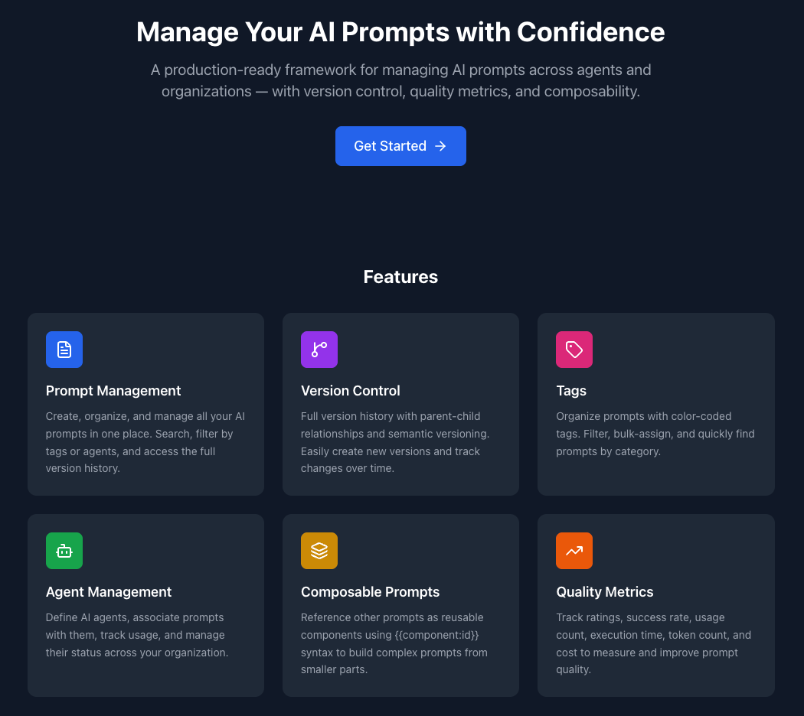

# Prompt Management Framework

[](https://github.com/ale-sanchez-g/open-prompt-manager/actions/workflows/ci.yml)
[](https://github.com/ale-sanchez-g/open-prompt-manager/actions/workflows/ci.yml)
[](https://github.com/ale-sanchez-g/open-prompt-manager/actions/workflows/security.yml)
[](https://github.com/ale-sanchez-g/open-prompt-manager/releases)
[](https://opensource.org/licenses/MIT)

A production-ready open-source framework for managing AI prompts across agents and organizations — with version control, quality metrics, and composability.

<!-- OPM img -->


## Application Overview

When you open the application, you will first land on the **Landing Page** (`/`), which introduces Prompt Manager and explains how it works. From there, clicking **Get Started** or **Go to Dashboard** takes you to the **Dashboard** (`/dashboard`) where you can view statistics, recent prompts, and quality metrics.

The application version displayed in the sidebar and landing page header is fetched dynamically from the `GET /api/health` endpoint, so it always reflects the current backend version.

### Frontend Routes

| Path | Page | Description |
|------|------|-------------|
| `/` | Landing Page | Introduction to the application and how it works |
| `/dashboard` | Dashboard | Overview stats, recent prompts, and quality metrics |
| `/prompts` | Prompt List | Browse and search all prompts |
| `/prompts/new` | Prompt Editor | Create a new prompt |
| `/prompts/:id` | Prompt Detail | View a specific prompt |
| `/prompts/:id/edit` | Prompt Editor | Edit an existing prompt |
| `/tags` | Tags Management | Create and manage tags |
| `/agents` | Agents Management | Create and manage AI agents |
| `/agents/:id` | Agent Detail | View agent details and execution stats |
| `/api-docs` | API Documentation | Interactive API schema reference, user journeys, and endpoint guide |

## Features

- **Version Control** — Full history, parent-child relationships, semantic versioning
- **Tags** — Color-coded, filterable, bulk-assignable
- **Composable Prompts** — Component references via `{{component:id}}`, recursive rendering
- **Quality Metrics** — Ratings, success rate, usage count, execution time, token count, cost
- **Agent Management** — Define agents, associate prompts, track usage, manage status
- **Variable System** — Typed variables (string, number, boolean, array, object) with validation

## Tech Stack

| Layer | Technology |
|-------|-----------|
| Backend | Python 3.14, FastAPI, SQLAlchemy 2.0, Pydantic v2 |
| Database | SQLite (upgradeable to PostgreSQL/MySQL) |
| Frontend | React 20, Tailwind CSS, React Router v6, Axios |
| Infrastructure | Docker, Kubernetes, Helm 3 |
| AI Connectivity | MCP (Model Context Protocol) via `mcp==1.23.3` |

## Quick Start

### Docker Compose (recommended)

```bash
# Clone the repository
git clone https://github.com/your-org/prompt-management-framework
cd prompt-management-framework

# Start all services
make up
# or
docker-compose up -d
```

Access:
- **Landing Page**: http://localhost
- **Dashboard**: http://localhost/dashboard
- **Backend API**: http://localhost:8000/api
- **API Docs**: http://localhost:8000/api/docs
- **MCP Endpoint**: http://localhost:8000/mcp

### Local Development

```bash
# Backend
make dev-backend
# or
cd backend && pip install -r requirements.txt && uvicorn main:app --reload --port 8000

# Frontend (separate terminal)
make dev-frontend
# or
cd frontend && npm install && npm start
```

## AWS Terraform Deployment

Use the deployment script from the repository root for AWS infrastructure, images, and application rollout.

### Important schema upgrade note

If you are upgrading an environment that already has data in the `agents` table, you must run the `agents.updated_at` migration before or immediately after deploying backend code that expects that column.

This is required because the backend ORM now reads `agents.updated_at` when serializing agent data. Existing databases created before this change do not get the new column automatically from `Base.metadata.create_all()`.

Local Docker migration:

```bash
cd backend
python -m migrations.add_agent_updated_at
```

AWS ECS migration:

```bash
AWS_REGION=us-east-1 ./scripts/migration/2026-apr-09-aws-mig-001.sh
```

Optional forced backend refresh after the migration:

```bash
AWS_REGION=us-east-1 FORCE_NEW_DEPLOYMENT=true ./scripts/migration/2026-apr-09-aws-mig-001.sh
```

Detailed rollout guidance is documented in `migration/2026-apr-09-mig-001.md`.

### Deploy examples

```bash
# HTTP-only deployment
./deploy.sh

# HTTPS + Route 53 hosted zone
./deploy.sh --https --domain example.com --route53

# HTTPS + multiple domains
./deploy.sh --https --domain example.com --domain www.example.com --route53

# Custom region/environment
./deploy.sh --region ap-southeast-2 --env staging --https --domain staging.example.com --route53

# Destroy deployment
./deploy.sh --destroy --https --domain example.com --route53
```

The deploy workflow is staged and safer by default:
- Runs plan-to-file before full apply
- Stores plan logs under `terraform/.terraform.plans/`
- Checks ACM certificate status before creating HTTPS listener-dependent resources

### GitHub Actions tag-triggered deploy

`/.github/workflows/deploy.yml` runs automatically on pushes to release tags matching `v*.*.*` (for example `v1.4.2`), uses AWS OIDC (`aws-actions/configure-aws-credentials`) with no static AWS access keys, then:

1. Bootstraps ECR repositories via Terraform
2. Builds and pushes backend + frontend Docker images tagged with the release tag (and `latest`)
3. Runs full `terraform apply` with those image URIs

Required repository configuration:

- Secret: `AWS_DEPLOY_ROLE_ARN` (IAM role trusted by GitHub OIDC)
- Optional variables: `AWS_REGION`, `PROJECT_NAME`, `ENVIRONMENT` (defaults: `ap-southeast-2`, `open-prompt-manager`, `prod`)

### Domain Registration Script (Route 53 Domains)

Use `domainRego.sh` to check availability and register a domain in AWS.

```bash
# Dry-run (default): validates inputs and checks availability only
./domainRego.sh \
  --domain opm-<your-company>.com \
  --first-name Bob \
  --last-name Smith \
  --email example@example.com \
  --phone +61.455222555 \
  --address-1 "50 Example St" \
  --city Sydney \
  --state NSW \
  --zip 2000 \
  --country AU

# Submit purchase/registration request
./domainRego.sh \
  --domain opm-<your-company>.com \
  --first-name Bob \
  --last-name Smith \
  --email example@example.com \
  --phone +61.455222555 \
  --address-1 "50 Example St" \
  --city Sydney \
  --state NSW \
  --zip 2000 \
  --country AU \
  --execute
```

Track registration status:

```bash
./domainRego.sh --check-operation <operation-id>
```

Notes:
- Country must be a 2-letter ISO code (for example `AU`, `US`, `GB`).
- Script uses `us-east-1` for Route 53 Domains by default.
- Domain registration can still require registrar/ICANN email verification before ACM validation reaches `ISSUED`.

## API Reference

Full interactive documentation is available at runtime:

| Format | URL |
|--------|-----|
| Swagger UI | `http://localhost:8000/api/docs` |
| ReDoc | `http://localhost:8000/api/redoc` |
| OpenAPI JSON | `http://localhost:8000/api/openapi.json` |
| In-app guide | `http://localhost/api-docs` (user journeys, schemas, endpoint reference) |

### Prompts

| Method | Path | Description |
|--------|------|-------------|
| GET | `/api/prompts/` | List prompts. Query params: `search`, `tag_id`, `agent_id`, `skip`, `limit` |
| POST | `/api/prompts/` | Create a new root prompt |
| GET | `/api/prompts/{id}` | Get full prompt detail including tags, agents, variables and quality metrics |
| PUT | `/api/prompts/{id}` | Partial update — only supplied fields are changed; `tag_ids`/`agent_ids` replace the full list |
| DELETE | `/api/prompts/{id}` | Permanently delete a prompt and its executions/metrics |
| POST | `/api/prompts/{id}/versions` | Create a child version; omitted fields are inherited from the parent |
| GET | `/api/prompts/{id}/versions` | Get the full version lineage (root + all descendants) |
| POST | `/api/prompts/{id}/render` | Render the template with supplied variables and resolve component references |
| POST | `/api/prompts/{id}/executions` | Record an LLM execution; prompt stats are recalculated automatically |
| GET | `/api/prompts/{id}/executions` | Get execution history (most-recent first) |
| POST | `/api/prompts/{id}/metrics` | Add a custom numeric metric (e.g. `latency_p99`) |
| GET | `/api/prompts/{id}/metrics` | Get custom metrics (most-recent first) |

### Tags

| Method | Path | Description |
|--------|------|-------------|
| GET | `/api/tags/` | List all tags (alphabetical) |
| POST | `/api/tags/` | Create a tag — name must be unique, returns 409 on conflict |
| DELETE | `/api/tags/{id}` | Delete a tag and remove it from all associated prompts |

### Agents

| Method | Path | Description |
|--------|------|-------------|
| GET | `/api/agents/` | List all agents (alphabetical) |
| GET | `/api/agents/{id}` | Get agent details with associated prompts and execution stats |
| POST | `/api/agents/` | Register an agent — name must be unique, returns 409 on conflict |
| PUT | `/api/agents/{id}` | Partial update — only supplied fields are changed |
| DELETE | `/api/agents/{id}` | Delete an agent and remove it from all associated prompts |

### Health

| Method | Path | Description |
|--------|------|-------------|
| GET | `/api/health` | Liveness check — returns `{ "status": "ok", "version": "<semver>" }`. The `version` field is consumed by the frontend to display the current application version. |

### Template Syntax

| Syntax | Effect |
|--------|--------|
| `{{variable_name}}` | Substituted with the matching value from the render request |
| `{{component:<id>}}` | Replaced with the fully-rendered content of the referenced prompt (recursive) |

Circular component references are detected and rejected with HTTP 422.

### Common Error Responses

| Status | Meaning |
|--------|---------|
| 400 | Bad request — invalid input |
| 404 | Resource not found |
| 409 | Conflict — duplicate name (tags, agents) |
| 422 | Validation error — missing required field or circular component reference |

## MCP Server

Open Prompt Manager exposes an [MCP (Model Context Protocol)](https://modelcontextprotocol.io/) server so AI coding assistants (GitHub Copilot, Claude Code, etc.) can discover and use prompts programmatically without any custom integration code.

### Endpoint

```
POST http://localhost:8000/mcp
```

The server uses the **Streamable HTTP** transport (`stateless_http=True`), which means every request is self-contained — no persistent session is required.

### Available Tools

| Tool | Description |
|------|-------------|
| `list_prompts` | List prompts, optionally filtered by a search string. Each result includes `is_latest` |
| `get_prompt` | Retrieve a single prompt by ID. Includes `is_latest` to indicate whether it is the most recent version |
| `get_prompt_versions` | Retrieve the full version history for a prompt. Each entry includes `is_latest` |
| `render_prompt` | Render a prompt, substituting variables and resolving components |
| `create_prompt` | Create a new prompt |
| `list_tags` | List all tags |
| `create_tag` | Create a new tag |
| `list_agents` | List all registered agents |

### Environment Variables

| Variable | Default | Description |
|----------|---------|-------------|
| `MCP_ALLOWED_HOSTS` | `localhost,localhost:8000,127.0.0.1,127.0.0.1:8000` | Comma-separated list of host names allowed to connect to the MCP endpoint (DNS rebinding protection). Add your production domain here. |

### Connect from VS Code (GitHub Copilot)

Create or update `.vscode/mcp.json` in your project:

```json
{
  "servers": {
    "open-prompt-manager": {
      "type": "http",
      "url": "http://localhost:8000/mcp"
    }
  }
}
```

Open the **Chat** panel in VS Code, switch to **Agent mode**, and your prompts will be available as context tools.

### Connect from Claude Code

```bash
claude mcp add --transport http open-prompt-manager http://localhost:8000/mcp
```

Verify the server is registered:

```bash
claude mcp list
```

Claude Code will now be able to call `list_prompts`, `get_prompt`, `render_prompt`, `create_prompt`, `list_tags`, `create_tag`, and `list_agents` as tools during conversations.

### Production Deployment

When running behind a load balancer or reverse proxy, allow the production host:

```bash
MCP_ALLOWED_HOSTS="localhost,localhost:8000,prompt-manager.yourdomain.com" docker-compose up -d
```

The AWS ALB listener rule in `terraform/alb.tf` already routes `/mcp` and `/mcp/*` requests to the backend target group.

## Prompt Syntax

### Variables
Use `{{variable_name}}` in prompt content:
```
You are a helpful assistant. The user's name is {{user_name}} and they need help with {{topic}}.
```

### Component References
Reference other prompts as reusable components using the `{{component:<id>}}` syntax:
```
{{component:42}}

Now respond to: {{user_message}}
```

Components are resolved **recursively** at render time: if the referenced prompt itself contains `{{component:…}}` references, those are resolved too (circular references are detected and rejected).

#### Using Components in the Editor

1. Open a prompt in the editor (`/prompts/new` or `/prompts/:id/edit`).
2. Use the **Components** section in the sidebar to search for an existing prompt by name.
3. Click a result to insert the `{{component:<id>}}` snippet into the content area. An active-component chip appears showing the referenced prompt name.
4. The derived component IDs are automatically included in the `components` field when the prompt is saved.

#### Viewing Components in the Detail Page

The prompt detail page (`/prompts/:id`) shows a **Components** sidebar card listing every prompt referenced in the content. Each entry links directly to the component prompt and shows its current version. Variables defined in component prompts are **merged** with the parent prompt's own variables (deduplicated by name) and appear in both the Variables sidebar and the Test Rendering panel.

#### API: `components` field

Include `components` (an array of referenced prompt IDs) in the create or update payload to persist the relationship explicitly:

```json
{
  "name": "My composite prompt",
  "content": "Preamble: {{component:5}}\n\nUser: {{question}}",
  "components": [5]
}
```

The render response includes a `components_resolved` field listing every component ID that was substituted during rendering:

```json
{
  "rendered_content": "Preamble: <component 5 content>\n\nUser: ...",
  "variables_used": ["question"],
  "components_resolved": [5]
}
```

### Render Example

```bash
curl -X POST http://localhost:8000/api/prompts/1/render \
  -H "Content-Type: application/json" \
  -d '{"variables": {"user_name": "Alice", "topic": "Python"}}'
```

## Project Structure

```
prompt-management-framework/
├── backend/
│   ├── app/
│   │   ├── models/
│   │   │   ├── prompt.py          # SQLAlchemy models
│   │   │   └── schemas.py         # Pydantic schemas
│   │   ├── api/
│   │   │   ├── prompts.py         # Prompt endpoints
│   │   │   └── tags_agents.py     # Tags and Agents endpoints
│   │   ├── services/
│   │   │   └── prompt_service.py  # Business logic
│   │   ├── database/
│   │   │   └── base.py            # Database configuration
│   │   └── mcp_server.py          # MCP server (AI agent connectivity)
│   ├── migrations/
│   │   └── add_agent_updated_at.py # One-off schema migration for legacy agents tables
│   ├── main.py
│   ├── requirements.txt
│   └── Dockerfile
├── frontend/
│   ├── src/
│   │   ├── pages/
│   │   │   ├── LandingPage.js
│   │   │   ├── Dashboard.js
│   │   │   ├── PromptList.js
│   │   │   ├── PromptEditor.js
│   │   │   ├── PromptDetail.js
│   │   │   ├── TagsManagement.js
│   │   │   └── AgentsManagement.js
│   │   ├── services/
│   │   │   └── api.js
│   │   ├── App.js
│   │   └── index.js
│   ├── package.json
│   ├── Dockerfile
│   └── nginx.conf
├── e2e-test/
│   ├── specs/
│   │   ├── prompts/               # Prompt CRUD & render API tests
│   │   ├── components/            # Composable prompts E2E tests
│   │   ├── agents/                # Agents API tests
│   │   ├── tags/                  # Tags API tests
│   │   ├── health/                # Health-check tests
│   │   ├── edge-cases/            # Error handling & boundary tests
│   │   ├── data-integrity/        # Data integrity tests
│   │   ├── performance/           # Performance tests
│   │   └── mcp/                   # MCP connectivity tests
│   ├── playwright.config.ts
│   └── package.json
├── helm/
│   └── prompt-manager/
│       ├── Chart.yaml
│       ├── values.yaml
│       └── templates/
├── docker-compose.yml
├── Makefile
├── migration/
│   └── 2026-apr-09-mig-001.md     # Migration runbook and rollout notes
├── scripts/
│   └── migration/
│       └── 2026-apr-09-aws-mig-001.sh # Run the agent migration as a one-off ECS task
└── README.md
```

## Kubernetes / Helm Deployment

```bash
# Build and push images
make build VERSION=1.0.0 REGISTRY=your-registry
make push VERSION=1.0.0 REGISTRY=your-registry

# Deploy with Helm
make helm-install VERSION=1.0.0 REGISTRY=your-registry

# Upgrade existing deployment
make helm-upgrade VERSION=1.2.0 REGISTRY=your-registry

# Uninstall
make helm-uninstall
```

### Custom values

```bash
helm install prompt-manager ./helm/prompt-manager \
  --set backend.image.repository=your-registry/backend \
  --set backend.image.tag=1.0.0 \
  --set frontend.image.repository=your-registry/frontend \
  --set frontend.image.tag=1.0.0 \
  --set ingress.hosts[0].host=prompt-manager.yourdomain.com
```

## Environment Variables

### Backend
| Variable | Default | Description |
|----------|---------|-------------|
| `DATABASE_URL` | `sqlite:///./data/prompts.db` | Database connection string |
| `CORS_ORIGINS` | `http://localhost,http://localhost:3000` | Comma-separated allowed CORS origins |
| `MCP_ALLOWED_HOSTS` | `localhost,localhost:8000,127.0.0.1,127.0.0.1:8000` | Comma-separated host names allowed to connect to the MCP endpoint |

### Frontend
| Variable | Default | Description |
|----------|---------|-------------|
| `REACT_APP_API_URL` | `` (same origin) | Backend API base URL — leave empty when deploying behind a reverse proxy or ALB. Set to the full backend URL (e.g. `http://localhost:8000`) only for standalone local development. |

## Version Control

Create a new version from an existing prompt:

```bash
curl -X POST http://localhost:8000/api/prompts/1/versions \
  -H "Content-Type: application/json" \
  -d '{"content": "Updated content here", "description": "Fixed typo in greeting"}'
```

Versions are automatically given the next patch version (e.g., `1.0.0` → `1.0.1`). Supply a custom `version` field to override.

Every prompt response (REST API and MCP tools) includes an `is_latest` boolean field. A prompt is `is_latest=true` when it has no child versions created from it. Because `POST /api/prompts/{id}/versions` can be called on any existing version, version history can branch, and a branched history may therefore contain multiple versions with `is_latest=true` (one for each leaf branch). Use `GET /api/prompts/{id}/versions` to list all versions in a chain with their `is_latest` flags, or the `get_prompt_versions` MCP tool for the same information from an AI agent.

## Tracking Executions

```bash
curl -X POST http://localhost:8000/api/prompts/1/executions \
  -H "Content-Type: application/json" \
  -d '{
    "agent_id": 2,
    "input_variables": {"user_name": "Alice"},
    "rendered_prompt": "Hello Alice...",
    "response": "How can I help?",
    "execution_time_ms": 342,
    "token_count": 128,
    "cost": 0.0004,
    "success": 1,
    "rating": 5
  }'
```

Execution stats (`avg_rating`, `success_rate`, `usage_count`) are automatically updated on the prompt.

## License

MIT License — see [LICENSE](LICENSE) for details.
