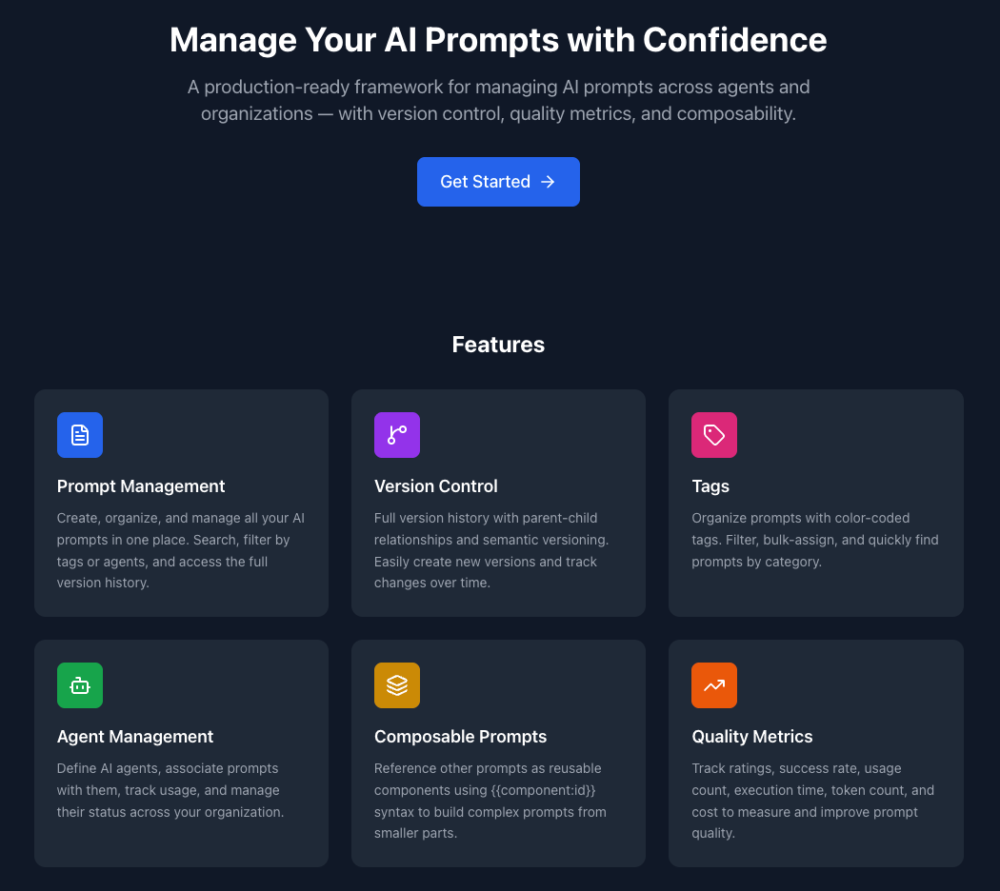

# Prompt Management Framework

[](https://github.com/ale-sanchez-g/open-prompt-manager/actions/workflows/ci.yml)
[](https://github.com/ale-sanchez-g/open-prompt-manager/actions/workflows/ci.yml)
[](https://github.com/ale-sanchez-g/open-prompt-manager/actions/workflows/security.yml)
[](https://github.com/ale-sanchez-g/open-prompt-manager/releases)
[](https://opensource.org/licenses/MIT)

A production-ready open-source framework for managing AI prompts across agents and organizations — with version control, quality metrics, and composability.

<!-- OPM img -->


## Application Overview

Authenticated users land on the protected **Dashboard** (`/dashboard`) after signing in. Unauthenticated visitors are redirected to **Login** (`/login`) or can register at **`/register`** before accessing the rest of the application, including the protected **Landing Page** (`/`) and **Dashboard** (`/dashboard`).

The application version displayed in the sidebar and landing page header is fetched dynamically from the `GET /api/health` endpoint, so it always reflects the current backend version.

### Frontend Routes

| Path | Page | Description |
|------|------|-------------|
| `/login` | Login | Sign in with an email and password to get an access token |
| `/register` | Register | Create a new account with password complexity validation |
| `/` | Landing Page | Protected product overview shown after authentication |
| `/dashboard` | Dashboard | Overview stats, recent prompts, and quality metrics |
| `/prompts` | Prompt List | Browse, search, and open prompts (edit shortcut per tile) |
| `/prompts/new` | Prompt Editor | Create a new prompt |
| `/prompts/:id` | Prompt Detail | View a specific prompt, and copy, edit, or delete it |
| `/prompts/:id/edit` | Prompt Editor | Edit an existing prompt |
| `/tags` | Tags Management | Create and manage tags |
| `/agents` | Agents Management | Create and manage AI agents |
| `/agents/:id` | Agent Detail | View agent details and execution stats |
| `/api-docs` | API Documentation | Interactive API schema reference, user journeys, and endpoint guide |
| `/admin` | User Management | **Admin only** — add, update, and remove users and roles |

## Features

- **Version Control** — Full history, parent-child relationships, semantic versioning
- **Tags** — Color-coded, filterable, bulk-assignable
- **Composable Prompts** — Component references via `{{component:id}}`, recursive rendering
- **Quality Metrics** — Ratings, success rate, usage count, execution time, token count, cost
- **Agent Management** — Define agents, associate prompts, track usage, manage status
- **Variable System** — Typed variables (string, number, boolean, array, object) with validation
- **JWT Authentication** — Email/password login, refresh-token cookies, route guards, and automatic access-token refresh
- **Role-Based Access Control** — `admin` and `user` roles carried in the access token. The first registered account becomes an admin (additional admins can be bootstrapped via `ADMIN_EMAILS`); admins get a dedicated user-management panel to add, update, and remove users and roles
- **Rate Limiting** — Sliding-window IP-based throttling to protect against brute-force and DDoS (60 auth / 200 API requests per minute per IP by default, configurable via environment variables)
- **Safe Deletes** — Destructive actions use an accessible inline confirmation (Confirm/Cancel in place) instead of disruptive browser pop-ups; `Esc` or clicking away cancels

## Tech Stack

| Layer | Technology |
|-------|-----------|
| Backend | Python 3.14, FastAPI, SQLAlchemy 2.0, Pydantic v2 |
| Database | SQLite (upgradeable to PostgreSQL) |
| Frontend | React 19, Tailwind CSS, React Router v7, Axios |
| Infrastructure | Docker, Kubernetes, Helm 3 |
| AI Connectivity | MCP (Model Context Protocol) node package |

## Quick Start

### Docker Compose (recommended)

```bash
# Clone the repository
git clone https://github.com/ale-sanchez-g/open-prompt-manager.git
cd open-prompt-manager

# Start all services
make up
# or
docker-compose up -d
```

Access:
- **Landing Page**: http://localhost
- **Dashboard**: http://localhost/dashboard
- **Backend API**: http://localhost:8000/api
- **API Docs**: http://localhost:8000/api/docs

Set `JWT_SECRET` before starting Docker Compose or local backend development so the backend can sign access and refresh tokens. Terraform generates this secret automatically for ECS deployments, while Helm exposes `backend.env.JWT_SECRET` for cluster-specific secret injection.

### Local Development

```bash
# Backend
make dev-backend
# or
cd backend && pip install -r requirements.txt && uvicorn main:app --reload --port 8000

# Frontend (separate terminal)
make dev-frontend
# or
cd frontend && npm ci --legacy-peer-deps && npm start
```

## AWS Terraform Deployment

Use the deployment script from the repository root for AWS infrastructure, images, and application rollout.

> **Upgrade note (existing deployments):** the ECR repositories are encrypted with a customer-managed KMS key. Switching an existing environment to KMS encryption forces replacement of the ECR repositories, which removes their stored images (`force_delete` is set). Re-push the backend and frontend images after applying — `./deploy.sh` does this automatically. New deployments are unaffected. See [`terraform/install.md`](terraform/install.md) for details.

### Database schema upgrades

`Base.metadata.create_all()` only creates missing tables — it never alters existing ones — so additive columns introduced by new backend code (for example `agents.updated_at` or `users.role`) must be applied to existing databases by a migration.

**`./deploy.sh` runs these migrations automatically.** After Terraform rolls out the new backend image, Step 8 of the deploy script runs every migration module as a one-off ECS task against RDS (via `scripts/migration/run_aws_migration.sh`) and then forces a fresh backend deployment so the running tasks always execute against the upgraded schema. The migration modules are idempotent, so this is safe to run on every deploy.

To run migrations manually (or against a non-`deploy.sh` environment):

Local Docker migration:

```bash
cd backend
python -m migrations.add_agent_updated_at   # MIG-001: agents.updated_at
python -m migrations.add_user_role          # MIG-002: users.role
```

AWS ECS migration — run any migration module(s) as a one-off task with the reusable runner:

```bash
AWS_REGION=us-east-1 ./scripts/migration/run_aws_migration.sh migrations.add_user_role

# Or use the dated convenience wrappers:
AWS_REGION=us-east-1 ./scripts/migration/2026-apr-09-aws-mig-001.sh   # agents.updated_at
AWS_REGION=us-east-1 ./scripts/migration/2026-jun-20-aws-mig-002.sh   # users.role
```

Add `FORCE_NEW_DEPLOYMENT=true` to roll the backend service after the migration completes.

Detailed rollout guidance is documented in `migration/2026-apr-09-mig-001.md` and `migration/2026-jun-20-mig-002.md`.

### Deploy examples

```bash
# HTTP-only deployment
./deploy.sh

# HTTPS + Route 53 hosted zone
./deploy.sh --https --domain example.com --route53

# HTTPS + multiple domains
./deploy.sh --https --domain example.com --domain www.example.com --route53

# Custom region/environment
./deploy.sh --region ap-southeast-2 --env staging --https --domain staging.example.com --route53

# Destroy deployment
./deploy.sh --destroy --https --domain example.com --route53
```

The deploy workflow is staged and safer by default:
- Runs plan-to-file before full apply
- Stores plan logs under `terraform/.terraform.plans/`
- Checks ACM certificate status before creating HTTPS listener-dependent resources

### Publish MCP Node package to npm

Use the repository helper script to publish `mcp-package-node` (`open-prompt-manager-mcp`) to npm with preflight checks.
Versioning is intentionally handled outside this script.

```bash
# Default publish flow (tests + npm publish)
./deploy_to_npm.sh

# Validate publish payload without publishing
./deploy_to_npm.sh --dry-run
```

What the script does:
- Validates required tools (`git`, `node`, `npm`) and npm authentication (`npm whoami`)
- Enforces Node.js 24+ (matches `mcp-package-node` engines)
- Installs dependencies, runs `mcp-package-node` tests, and runs `npm pack --dry-run`
- Publishes with `npm publish` (unless `--dry-run`)

Optional flags:
- `--skip-tests` to skip package tests
- `--allow-dirty` to allow publishing from a non-clean git working tree

### GitHub Actions tag-triggered deploy

`/.github/workflows/deploy.yml` runs automatically on pushes to release tags matching `v*.*.*` (for example `v1.4.2`), uses AWS OIDC (`aws-actions/configure-aws-credentials`) with no static AWS access keys, then:

1. Verifies the tagged commit has a passing CI run (`ci-gate` job — a tag without green CI does not deploy)
2. Waits for approval on the `prod` GitHub environment (when required reviewers are configured)
3. Bootstraps ECR repositories via Terraform
4. Builds backend + frontend Docker images, scans them with Trivy (fails on HIGH/CRITICAL CVEs), generates SBOM artifacts, then pushes the images tagged with the release tag (and `latest`)
5. Runs full `terraform apply` with those image URIs
6. Smoke-tests the deployment by polling `<application_url>/api/ready` for up to 5 minutes

**Rollback:** trigger the workflow manually (`workflow_dispatch`) with the `rollback_to_tag` input set to a previously deployed `vX.Y.Z` tag — it re-points the infrastructure at that tag's already-built images and re-runs the smoke test. See [`docs/runbooks/deploy-rollback.md`](docs/runbooks/deploy-rollback.md) for the full procedure.

Required repository configuration:

- Secret: `AWS_DEPLOY_ROLE_ARN` (IAM role trusted by GitHub OIDC). The role needs `kms:Decrypt` on the `alias/<project>-secrets` key so re-deploys can read the existing `JWT_SECRET`. See [`terraform/install.md`](terraform/install.md#prerequisites) for the full permission list.
- Environment: create a `prod` environment (Settings → Environments) and add required reviewers to enable the manual approval gate.
- Optional variables: `AWS_REGION`, `PROJECT_NAME`, `ENVIRONMENT` (defaults: `ap-southeast-2`, `open-prompt-manager`, `prod`)

### Domain Registration Script (Route 53 Domains)

Use `domainRego.sh` to check availability and register a domain in AWS.

```bash
# Dry-run (default): validates inputs and checks availability only
./domainRego.sh \
  --domain opm-<your-company>.com \
  --first-name Bob \
  --last-name Smith \
  --email example@example.com \
  --phone +61.455222555 \
  --address-1 "50 Example St" \
  --city Sydney \
  --state NSW \
  --zip 2000 \
  --country AU

# Submit purchase/registration request
./domainRego.sh \
  --domain opm-<your-company>.com \
  --first-name Bob \
  --last-name Smith \
  --email example@example.com \
  --phone +61.455222555 \
  --address-1 "50 Example St" \
  --city Sydney \
  --state NSW \
  --zip 2000 \
  --country AU \
  --execute
```

Track registration status:

```bash
./domainRego.sh --check-operation <operation-id>
```

Notes:
- Country must be a 2-letter ISO code (for example `AU`, `US`, `GB`).
- Script uses `us-east-1` for Route 53 Domains by default.
- Domain registration can still require registrar/ICANN email verification before ACM validation reaches `ISSUED`.

## API Reference

Full interactive documentation is available at runtime:

| Format | URL |
|--------|-----|
| Swagger UI | `http://localhost:8000/api/docs` |
| ReDoc | `http://localhost:8000/api/redoc` |
| OpenAPI JSON | `http://localhost:8000/api/openapi.json` |
| In-app guide | `http://localhost/api-docs` (user journeys, schemas, endpoint reference) |

### Prompts

Prompts follow a **shared-workspace read / owner-scoped write** model: every
authenticated user can list and read any prompt, but `PUT`, `DELETE`, and
`POST /versions` require the caller to be the prompt's creator (`created_by`)
or an `admin`. Non-owner mutation attempts receive
`403 {"detail": "You do not have permission to modify this prompt."}`.

| Method | Path | Description |
|--------|------|-------------|
| GET | `/api/prompts/` | List prompts. Query params: `search`, `tag_id`, `agent_id`, `skip`, `limit` |
| POST | `/api/prompts/` | Create a new root prompt |
| GET | `/api/prompts/{id}` | Get full prompt detail including tags, agents, variables and quality metrics |
| PUT | `/api/prompts/{id}` | Partial update — only supplied fields are changed; `tag_ids`/`agent_ids` replace the full list. Owner or admin only |
| DELETE | `/api/prompts/{id}` | Permanently delete a prompt and its executions/metrics. Owner or admin only |
| POST | `/api/prompts/{id}/versions` | Create a child version; omitted fields are inherited from the parent. Owner or admin only |
| GET | `/api/prompts/{id}/versions` | Get the full version lineage (root + all descendants) |
| POST | `/api/prompts/{id}/render` | Render the template with supplied variables and resolve component references |
| POST | `/api/prompts/{id}/executions` | Record an LLM execution; prompt stats are recalculated automatically |
| GET | `/api/prompts/{id}/executions` | Get execution history (most-recent first) |
| POST | `/api/prompts/{id}/metrics` | Add a custom numeric metric (e.g. `latency_p99`) |
| GET | `/api/prompts/{id}/metrics` | Get custom metrics (most-recent first) |

### Tags

| Method | Path | Description |
|--------|------|-------------|
| GET | `/api/tags/` | List all tags (alphabetical) |
| POST | `/api/tags/` | Create a tag — name must be unique, returns 409 on conflict |
| DELETE | `/api/tags/{id}` | Delete a tag and remove it from all associated prompts |

### Agents

| Method | Path | Description |
|--------|------|-------------|
| GET | `/api/agents/` | List all agents (alphabetical) |
| GET | `/api/agents/{id}` | Get agent details with associated prompts and execution stats |
| POST | `/api/agents/` | Register an agent — name must be unique, returns 409 on conflict |
| PUT | `/api/agents/{id}` | Partial update — only supplied fields are changed |
| DELETE | `/api/agents/{id}` | Delete an agent and remove it from all associated prompts |

### Authentication

| Method | Path | Description |
|--------|------|-------------|
| POST | `/auth/register` | Register a user account with email + password complexity validation. The first account to register becomes an `admin`; all later accounts are standard `user`s |
| POST | `/auth/login` | Issue a 15-minute access token (carrying the user's `role`) and set the refresh token cookie |
| POST | `/auth/refresh` | Exchange a valid refresh-token cookie for a new access token |
| POST | `/auth/logout` | Revoke the current refresh token and clear the cookie |
| GET | `/auth/me` | Return the authenticated user's `id`, `email`, and `role` |

### Admin (user & role management)

Every endpoint below requires a bearer access token belonging to an `admin` user. Non-admins receive `403 {"error": "admin_required"}`.

| Method | Path | Description |
|--------|------|-------------|
| GET | `/api/admin/users` | List all users with their roles |
| POST | `/api/admin/users` | Create a user with a chosen role (`admin` or `user`) |
| PATCH | `/api/admin/users/{id}` | Update a user's `role` and/or `password`. Admins cannot demote themselves |
| DELETE | `/api/admin/users/{id}` | Delete a user. Admins cannot delete their own account |

### Health

| Method | Path | Description |
|--------|------|-------------|
| GET | `/api/health` | Liveness check — returns `{ "status": "ok", "version": "<semver>" }`. The `version` field is consumed by the frontend to display the current application version. |
| GET | `/api/ready` | Readiness check — runs `SELECT 1` against the database and returns `503` if the database is unavailable. |

### Template Syntax

| Syntax | Effect |
|--------|--------|
| `{{variable_name}}` | Substituted with the matching value from the render request |
| `{{component:<id>}}` | Replaced with the fully-rendered content of the referenced prompt (recursive) |

Circular component references are detected and rejected with HTTP 422.

### Common Error Responses

| Status | Meaning |
|--------|---------|
| 400 | Bad request — invalid input |
| 401 | Missing/expired credentials, or login blocked by the temporary lockout |
| 403 | Forbidden — caller is not the prompt's owner/admin (prompt mutations) or not an admin (`admin_required`) |
| 404 | Resource not found |
| 409 | Conflict — duplicate name (tags, agents) |
| 422 | Validation error — missing required field or circular component reference |

## Prompt Syntax

### Variables
Use `{{variable_name}}` in prompt content:
```
You are a helpful assistant. The user's name is {{user_name}} and they need help with {{topic}}.
```

### Component References
Reference other prompts as reusable components using the `{{component:<id>}}` syntax:
```
{{component:42}}

Now respond to: {{user_message}}
```

Components are resolved **recursively** at render time: if the referenced prompt itself contains `{{component:…}}` references, those are resolved too (circular references are detected and rejected).

#### Using Components in the Editor

1. Open a prompt in the editor (`/prompts/new` or `/prompts/:id/edit`).
2. Use the **Components** section in the sidebar to search for an existing prompt by name.
3. Click a result to insert the `{{component:<id>}}` snippet into the content area. An active-component chip appears showing the referenced prompt name.
4. The derived component IDs are automatically included in the `components` field when the prompt is saved.

#### Viewing Components in the Detail Page

The prompt detail page (`/prompts/:id`) shows a **Components** sidebar card listing every prompt referenced in the content. Each entry links directly to the component prompt and shows its current version. Variables defined in component prompts are **merged** with the parent prompt's own variables (deduplicated by name) and appear in both the Variables sidebar and the Test Rendering panel.

#### API: `components` field

Include `components` (an array of referenced prompt IDs) in the create or update payload to persist the relationship explicitly:

```json
{
  "name": "My composite prompt",
  "content": "Preamble: {{component:5}}\n\nUser: {{question}}",
  "components": [5]
}
```

The render response includes a `components_resolved` field listing every component ID that was substituted during rendering:

```json
{
  "rendered_content": "Preamble: <component 5 content>\n\nUser: ...",
  "variables_used": ["question"],
  "components_resolved": [5]
}
```

### Render Example

```bash
curl -X POST http://localhost:8000/api/prompts/1/render \
  -H "Content-Type: application/json" \
  -d '{"variables": {"user_name": "Alice", "topic": "Python"}}'
```

## Project Structure

```
open-prompt-manager/
├── backend/
│   ├── app/
│   │   ├── models/
│   │   │   ├── auth.py            # User, role, and refresh-token models
│   │   │   ├── prompt.py          # SQLAlchemy models
│   │   │   └── schemas.py         # Pydantic schemas
│   │   ├── api/
│   │   │   ├── auth.py            # Register, login, refresh, logout, me endpoints
│   │   │   ├── admin.py           # Admin-only user & role management endpoints
│   │   │   ├── dependencies.py    # Shared auth dependencies (get_current_user, require_admin)
│   │   │   ├── prompts.py         # Prompt endpoints
│   │   │   └── tags_agents.py     # Tags and Agents endpoints
│   │   ├── services/
│   │   │   ├── auth_service.py    # Auth, JWT, and user/role business logic
│   │   │   └── prompt_service.py  # Business logic
│   │   ├── database/
│   │   │   └── base.py            # Database configuration
│   │   ├── migrations/
│   │   │   ├── add_agent_updated_at.py # One-off schema migration for legacy agents tables
│   │   │   └── add_user_role.py   # One-off schema migration adding users.role
│   │   ├── main.py
│   │   ├── requirements.txt
│   │   └── Dockerfile
├── frontend/
│   ├── src/
│   │   ├── pages/
│   │   │   ├── LandingPage.jsx
│   │   │   ├── LoginPage.jsx
│   │   │   ├── RegisterPage.jsx
│   │   │   ├── Dashboard.jsx
│   │   │   ├── PromptList.jsx
│   │   │   ├── PromptEditor.jsx
│   │   │   ├── PromptDetail.jsx
│   │   │   ├── TagsManagement.jsx
│   │   │   ├── AgentsManagement.jsx
│   │   │   ├── AgentDetail.jsx
│   │   │   ├── ApiDocs.jsx
│   │   │   └── UserManagement.jsx  # Admin-only user & role management page
│   │   ├── services/
│   │   │   └── api.js
│   │   ├── App.jsx
│   │   └── index.jsx
│   ├── package.json
│   ├── Dockerfile
│   └── nginx.conf
├── e2e-test/
│   ├── specs/
│   │   ├── prompts/               # Prompt CRUD & render API tests
│   │   ├── components/            # Composable prompts E2E tests
│   │   ├── agents/                # Agents API tests
│   │   ├── tags/                  # Tags API tests
│   │   ├── health/                # Health-check tests
│   │   ├── edge-cases/            # Error handling & boundary tests
│   │   ├── data-integrity/        # Data integrity tests
│   │   ├── performance/           # Performance tests
│   ├── playwright.config.ts
│   └── package.json
├── helm/
│   └── prompt-manager/
│       ├── Chart.yaml
│       ├── values.yaml
│       └── templates/
├── docker-compose.yml
├── Makefile
├── migration/
│   ├── 2026-apr-09-mig-001.md     # MIG-001 runbook (agents.updated_at)
│   └── 2026-jun-20-mig-002.md     # MIG-002 runbook (users.role)
├── scripts/
│   └── migration/
│       ├── run_aws_migration.sh        # Reusable: run any migration module(s) as one-off ECS tasks
│       ├── 2026-apr-09-aws-mig-001.sh  # Wrapper: agents.updated_at migration
│       └── 2026-jun-20-aws-mig-002.sh  # Wrapper: users.role migration
└── README.md
```

## Kubernetes / Helm Deployment

```bash
# Build and push images
make build VERSION=1.0.0 REGISTRY=your-registry
make push VERSION=1.0.0 REGISTRY=your-registry

# Deploy with Helm
make helm-install VERSION=1.0.0 REGISTRY=your-registry

# Upgrade existing deployment
make helm-upgrade VERSION=1.2.0 REGISTRY=your-registry

# Uninstall
make helm-uninstall
```

### Custom values

```bash
helm install prompt-manager ./helm/prompt-manager \
  --set backend.image.repository=your-registry/backend \
  --set backend.image.tag=1.0.0 \
  --set frontend.image.repository=your-registry/frontend \
  --set frontend.image.tag=1.0.0 \
  --set ingress.hosts[0].host=prompt-manager.yourdomain.com
```

## Operations & Observability

- **Incident-response runbooks** live in [`docs/runbooks/`](docs/runbooks/) — database unavailable, deploy rollback, auth outage / credential stuffing, ALB 5xx spike, and RDS failover, plus the on-call/escalation policy and a postmortem template.
- **Telemetry pipeline:** AWS deployments run an OpenTelemetry Collector (AWS Distro) as a sidecar in the backend ECS task (`terraform/otel.tf`). It receives OTLP on `localhost:4317` (gRPC) / `localhost:4318` (HTTP) and forwards to a configurable exporter — the default is a no-op `debug` exporter until an observability backend is selected. The collector config is stored as an SSM SecureString parameter (`/<project>/<env>/otel/collector-config`), so the exporter target can be flipped without rebuilding images. Backend containers receive `OTEL_EXPORTER_OTLP_*` env vars automatically for future instrumentation.
- **Backend selection:** evaluation spikes for Grafana LGTM and SigNoz are in [`docs/spikes/`](docs/spikes/); the platform decision is tracked in issue #346.
- **Audit trail:** structured JSON audit events (see [Audit Logging](#audit-logging)) ship to CloudWatch via the `awslogs` driver, ready for metric-filter alarms.

## Environment Variables

### Backend
| Variable | Default | Description |
|----------|---------|-------------|
| `DATABASE_URL` | `sqlite:///./data/prompts.db` | Database connection string |
| `JWT_SECRET` | _(required)_ | Secret used to sign access and refresh tokens. Must be set before the backend starts. |
| `ADMIN_EMAILS` | _(empty)_ | Comma-separated list of emails that are always assigned the `admin` role at registration. Provides a deterministic way to bootstrap administrators independent of registration order. The very first registered account is always made an admin regardless of this setting. |
| `CORS_ORIGINS` | `http://localhost,http://localhost:3000,vscode-file://vscode-app` | Comma-separated allowed CORS origins. Include `vscode-file://vscode-app` for VS Code MCP clients. |
| `MCP_ALLOWED_HOSTS` | `localhost,localhost:8000,127.0.0.1,127.0.0.1:8000` | Comma-separated host names allowed to connect to the MCP endpoint |
| `RATE_LIMIT_ENABLED` | `true` | Set to `false` to disable rate limiting entirely (not recommended for production). |
| `RATE_LIMIT_PER_MINUTE` | `200` | Maximum API requests per minute per client IP (all non-auth, non-health endpoints). |
| `RATE_LIMIT_AUTH_PER_MINUTE` | `60` | Maximum auth requests per minute per client IP (`/auth/*` endpoints). Lower limit defends against brute-force login attempts. |
| `LOG_LEVEL` | `INFO` | Root log level for the structured JSON logs written to stdout. |
| `LOGIN_LOCKOUT_THRESHOLD` | `5` | Failed login attempts per account within the window before further logins are temporarily blocked (emits an `auth.login.lockout` audit event). |
| `LOGIN_LOCKOUT_WINDOW_SECONDS` | `900` | Sliding window (seconds) for counting failed logins; also how long a lockout lasts. In-memory per process — use a shared store for multi-replica deployments. |

#### Rate Limiting

The backend enforces a sliding-window rate limit per client IP address:

| Endpoint group | Default limit | Configurable via |
|----------------|--------------|-----------------|
| `/auth/*` (login, register, refresh, logout) | 60 req/min | `RATE_LIMIT_AUTH_PER_MINUTE` |
| All other `/api/*` endpoints | 200 req/min | `RATE_LIMIT_PER_MINUTE` |
| `/api/health`, `/api/ready`, `/api/docs`, `/api/redoc` | Exempt | — |

When a limit is exceeded the API returns:

```http
HTTP/1.1 429 Too Many Requests
Retry-After: 42
X-RateLimit-Limit: 60
X-RateLimit-Window: 60
Content-Type: application/json

{"error": "rate_limit_exceeded", "detail": "Too many requests. Please slow down and try again."}
```

`X-Forwarded-For` is honoured so that the original client IP is used when the backend sits behind nginx or AWS ALB. See `docs/adr-rate-limiting.md` for the architecture decision record.

#### Audit Logging

The backend emits structured single-line JSON logs to stdout (shipped to
CloudWatch by the `awslogs` driver in AWS deployments). Security-relevant
actions produce audit events with stable dotted names — `auth.register`,
`auth.login.success`/`auth.login.failure`/`auth.login.lockout`,
`auth.token.issued`/`auth.token.refresh`/`auth.token.refresh_failure`/`auth.token.revoke`,
`auth.password.change`, and `admin.user.*` for admin user management. Each
event carries `actor`, `outcome`, `target`, `source_ip`, and a `request_id`
correlated via the `X-Request-ID` header (honoured inbound, echoed on every
response). Values under sensitive keys (password, token, hash, …) are
redacted before emission and again at format time; see
`backend/app/audit.py` for the full event schema.

### Frontend
| Variable | Default | Description |
|----------|---------|-------------|
| `VITE_API_URL` | `` (same origin) | Backend API base URL — leave empty when deploying behind a reverse proxy or ALB. Set to the full backend URL (e.g. `http://localhost:8000`) only for standalone local development. |
| `VITE_OTEL_ENABLED` | `false` | Enable browser Real User Monitoring via the OpenTelemetry Web SDK. Telemetry only activates when this is truthy **and** `VITE_OTEL_EXPORTER_URL` is set. |
| `VITE_OTEL_EXPORTER_URL` | _(empty)_ | OTLP/HTTP traces endpoint the browser exports to (e.g. the OTel Collector's `/v1/traces` route). |
| `VITE_OTEL_SERVICE_NAME` | `open-prompt-manager-frontend` | `service.name` resource attribute on exported spans. |
| `VITE_OTEL_ENVIRONMENT` | Vite `MODE` | `deployment.environment.name` resource attribute. |
| `VITE_OTEL_PROPAGATE_URLS` | _(empty)_ | Comma-separated extra trusted origins that receive W3C `traceparent` headers (same-origin and `VITE_API_URL` are always included). |
| `VITE_OTEL_SAMPLE_RATIO` | `1` | Trace sampling ratio in `[0, 1]`. |

When enabled, the frontend captures page loads, Web Vitals (LCP/CLS/INP),
unhandled JS errors, and fetch/XHR spans, with query strings and
credential-shaped attributes scrubbed before export. The OTel code is
dynamically imported, so disabled environments pay no bundle cost.

## Version Control

Create a new version from an existing prompt:

```bash
curl -X POST http://localhost:8000/api/prompts/1/versions \
  -H "Content-Type: application/json" \
  -d '{"content": "Updated content here", "description": "Fixed typo in greeting"}'
```

Versions are automatically given the next patch version (e.g., `1.0.0` → `1.0.1`). Supply a custom `version` field to override.

Every prompt response (REST API and MCP tools) includes an `is_latest` boolean field. A prompt is `is_latest=true` when it has no child versions created from it. Because `POST /api/prompts/{id}/versions` can be called on any existing version, version history can branch, and a branched history may therefore contain multiple versions with `is_latest=true` (one for each leaf branch). Use `GET /api/prompts/{id}/versions` to list all versions in a chain with their `is_latest` flags, or the `get_prompt_versions` MCP tool for the same information from an AI agent.

## Tracking Executions

```bash
curl -X POST http://localhost:8000/api/prompts/1/executions \
  -H "Content-Type: application/json" \
  -d '{
    "agent_id": 2,
    "input_variables": {"user_name": "Alice"},
    "rendered_prompt": "Hello Alice...",
    "response": "How can I help?",
    "execution_time_ms": 342,
    "token_count": 128,
    "cost": 0.0004,
    "success": 1,
    "rating": 5
  }'
```

Execution stats (`avg_rating`, `success_rate`, `usage_count`) are automatically updated on the prompt.

## License

MIT License — see [LICENSE](LICENSE) for details.
