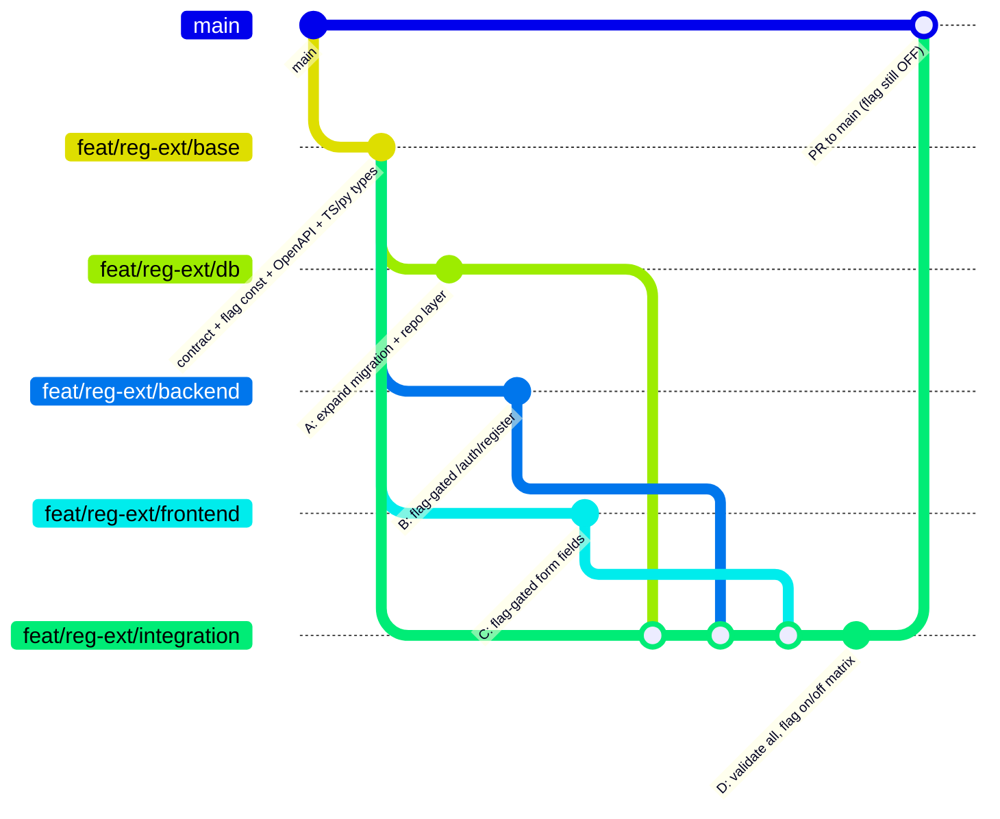

# OPM Registration — Extended Fields Behind an Unleash Toggle

**Spec ID:** OPM-FLAG-REG-001
**Owner:** Cross-functional (DB · Backend · Frontend)
**Repo:** `open-prompt-manager` (FastAPI + React, `opm-dx1.com`)
**Flag key:** `opm.registration-extended-fields`
**Default state:** `OFF` in every environment (dark launch, gradual rollout)
**Change class:** Reversible via flag flip (instant rollback, no redeploy)

---

## 1. Objective & scope

Add new fields to the OPM registration page. The change spans three layers — **frontend** (new form inputs), **backend** (validation + persistence on `POST /auth/register`), and **database** (new columns). Every layer must be gated behind a single Unleash flag so the whole feature ships dark and rolls out gradually.

**In scope:** the registration flow and the `users` table only.
**Out of scope:** login, profile edit, existing user backfill (a later, separate change).

### Worked example — the new fields

Swap these for your actual set; the pattern is identical either way.

| Field | Type | Nullable (expand phase) | Notes |
|---|---|---|---|
| `company_name` | string(200) | yes | Free text |
| `job_role` | string(120) | yes | Free text / enum later |
| `phone` | string(32) | yes | **PII** — audit + validate format |
| `marketing_opt_in` | boolean | yes (default `false`) | Consent — must default off |

---

## 2. Non-negotiable guardrails

1. **Contract-first.** The API schema, DB columns, and TS types are agreed *before* any layer is built, so the three swarm branches develop in parallel against the same contract.
2. **Everything behind the flag.** With the flag `OFF`, the registration page, API, and stored behaviour must be **byte-for-byte identical to today**.
3. **Expand/contract for the database.** New columns land **nullable with safe defaults** first (expand). Constraints (`NOT NULL`, enums) are only added *after* full rollout (contract). Never ship a breaking schema change behind a flag.
4. **One flag, evaluated on both sides, same stickiness.** Frontend and backend evaluate the *same* flag with the *same* `sessionId` so a visitor who is shown the new fields is always accepted by the API. See §4.2 — this is the most common failure mode.
5. **Graceful when present-but-off.** The backend treats extended fields as *optional when present* during rollout, so a mid-rollout percentage change can never hard-fail an in-flight registration.
6. **No PII in logs.** `phone` is PII: validate, persist, and audit-log the *event* (SIEM-ready), never the raw value in application logs.

---

## 3. The Unleash flag

### 3.1 Create the flag

| Setting | Value |
|---|---|
| Flag name | `opm.registration-extended-fields` |
| Type | Release |
| Project / env | OPM · `development`, `staging`, `production` |
| Strategy | **Gradual rollout** (`flexibleRollout`) |
| Stickiness | **`sessionId`** (registration is anonymous — there is no `userId` yet) |
| Rollout % | **0** in every environment at creation |

> Gradual rollout requires a `userId` **or** `sessionId` for stickiness. Because registration happens before a user exists, we anchor stickiness on a `sessionId` minted client-side and echoed to the backend.

### 3.2 Tokens (keep them separated)

- **Frontend token** (type `FRONTEND`) → used by the React SDK against `/api/frontend` (or Unleash Edge). Never expose a server token to the browser.
- **Server token** (type `Client`/backend) → used by the FastAPI SDK against `/api/`.

> `unleash-proxy` is in maintenance mode. Connect the frontend to the **Frontend API** (`<unleash-url>/api/frontend`) or **Unleash Edge** — not the legacy proxy.

---

## 4. Shared contract (source of truth for all three branches)

### 4.1 Flag constant

```ts
// packages/shared/flags.ts  and  app/core/flags.py
export const FLAG_REGISTRATION_EXTENDED = "opm.registration-extended-fields";
```

### 4.2 The sessionId handshake (read this twice)

```
Browser mints sessionId  ─┬─►  Unleash Frontend API  (evaluate flag, stickiness=sessionId)
                          │
                          └─►  POST /auth/register  { sessionId, ...fields }
                                        │
                                        └─►  Backend re-evaluates SAME flag with SAME sessionId
```

- The frontend **never** tells the backend "the flag is on". The backend re-evaluates independently, using the identical `sessionId`, so the decision is deterministic and consistent across the stack (same session + same rollout % → same result). The client's decision is a UI concern only; the backend's decision is the source of truth for persistence.

### 4.3 API contract (OpenAPI fragment)

```yaml
RegisterRequest:
  type: object
  required: [email, password, sessionId]
  properties:
    email:    { type: string, format: email }
    password: { type: string, minLength: 12 }
    sessionId:{ type: string }          # required in all states
    extended:                            # only honoured when flag ON for this sessionId
      type: object
      properties:
        companyName:    { type: string, maxLength: 200 }
        jobRole:        { type: string, maxLength: 120 }
        phone:          { type: string, maxLength: 32 }
        marketingOptIn: { type: boolean, default: false }
```

### 4.4 DB contract (expand phase — nullable, safe defaults)

```sql
ALTER TABLE users ADD COLUMN company_name      VARCHAR(200);
ALTER TABLE users ADD COLUMN job_role          VARCHAR(120);
ALTER TABLE users ADD COLUMN phone             VARCHAR(32);
ALTER TABLE users ADD COLUMN marketing_opt_in  BOOLEAN DEFAULT FALSE;
```

---

## 5. Staged implementation plan (risk-ordered)

| Stage | What ships | Flag | Reversible by | Independently deployable |
|---|---|---|---|---|
| **0** | Contract + flag created at 0% | OFF | — | n/a |
| **1** | DB expand migration (nullable cols) | OFF | forward-only, but inert | ✅ safe alone |
| **2** | Backend: flag-gated validate + persist | OFF | flag flip | ✅ dark |
| **3** | Frontend: flag-gated new fields | OFF | flag flip | ✅ dark |
| **4** | Integration validation branch (all merged) | OFF | flag flip | gate to prod |
| **5** | Progressive rollout 0→1→10→25→50→100% | ON (ramping) | flag flip | runbook §8 |
| **6** | Contract: enforce constraints, remove flag branches | n/a | code revert | after bake |

Stages 1–3 can land in **any order** because each is inert while the flag is off. Stage 4 is the merge/validate gate. Stage 5 is operational. Stage 6 is cleanup, only after §8 completes and bakes.

---

## 6. Agent swarm — branching model



- **`feat/reg-ext/base`** — created first. Contains only the shared contract (§4): flag constant, OpenAPI fragment, TS + Pydantic types, migration stub. All worker branches fork from here so they compile against one agreed interface and merge cleanly.
- **Three worker branches fork from `base`** and run in parallel (Agents A, B, C).
- **`feat/reg-ext/integration`** (Agent D) merges all three, then validates the full flag-state matrix before a single PR to `main`.

> The PR to `main` merges with the flag still **OFF at 0%**. Merging code and enabling the feature are separate acts.

---

## 7. Per-agent briefs (prompt-ready)

Each brief is self-contained. Every agent must: (a) keep all changes behind `FLAG_REGISTRATION_EXTENDED`, (b) prove the OFF path is unchanged, (c) branch from `feat/reg-ext/base`.

### Agent A — Database (`feat/reg-ext/db`)

**Goal:** Land the expand migration and repository plumbing. No constraints yet.
**Do:**
- Alembic migration adding the four columns (§4.4): nullable, `marketing_opt_in` defaults `false`.
- Update the ORM model + repository so it *can* read/write the columns, but writes remain caller-gated (the backend decides when to write).
- Down-migration drops the columns cleanly.
**Tests:**
- Migration up/down is reversible on a seeded copy.
- Existing rows are unaffected; `INSERT` without the new fields still succeeds.
- No `NOT NULL` / enum constraints in this branch.
**Done when:** migration applies to a prod-shaped DB with zero downtime and the OFF path reads/writes exactly as before.

### Agent B — Backend / API (`feat/reg-ext/backend`)

**Goal:** Flag-gate extended-field handling on `POST /auth/register`.
**Do:**
- Initialise the Unleash Python SDK (server token) once at startup (§9.2).
- Evaluate the flag with `context={"sessionId": payload.session_id}` and a `False` fallback.
- **Flag ON:** validate the `extended` block, persist via Agent A's repo, emit a SIEM-ready audit event (event only — no raw `phone`).
- **Flag OFF:** ignore any `extended` block entirely; behave exactly as the current endpoint.
- Treat extended fields as *optional when present* to survive a mid-rollout flip.
**Tests (both flag states):**
- OFF: request with and without `extended` → legacy response, nothing persisted.
- ON: valid `extended` persists; invalid `extended` returns 422; missing `extended` still registers.
- Same `sessionId` yields the same flag decision across repeated calls (determinism).
**Done when:** contract tests pass against the §4.3 schema in both states and audit logging omits PII.

### Agent C — Frontend (`feat/reg-ext/frontend`)

**Goal:** Render the new fields only when the flag is on for the visitor.
**Do:**
- Mint a stable `sessionId` per visit; pass it into the Unleash React context **and** the register request body (§4.2).
- Wrap the new inputs in `useFlag(FLAG_REGISTRATION_EXTENDED)`.
- Client-side validation mirrors the API contract; `marketingOptIn` renders unchecked (opt-in).
- **Flag OFF:** the form is pixel-identical to today; no new DOM, no layout shift.
**Tests (both flag states):**
- OFF: snapshot matches current form; no extended inputs mount.
- ON: fields render, validate, and submit with `sessionId`.
- Playwright E2E for both states (reuse the cached OPM E2E setup).
**Done when:** the flag toggles the UI with no visual regression in the OFF state.

### Agent D — Integration & validation (`feat/reg-ext/integration`)

**Goal:** Merge A + B + C and prove the whole thing before it can reach prod. **Ships nothing new** — it only validates and merges. See §8.

---

## 8. Validation branch — acceptance matrix

Agent D merges the three branches and runs the full matrix in `staging` before the PR to `main` is approved.

| # | Scenario | Expected |
|---|---|---|
| 1 | Flag **OFF**, register without extended | Legacy behaviour, new columns stay null |
| 2 | Flag **OFF**, register *with* stray extended block | Ignored, no error, nothing persisted |
| 3 | Flag **ON** (100% in staging), full journey | Fields render → validate → persist → visible in DB |
| 4 | Flag **ON**, invalid extended payload | 422, no partial write |
| 5 | **Cross-stack consistency** | Same `sessionId`: UI shows fields ⇔ API accepts them |
| 6 | **Rollback** — flip flag OFF mid-session | Returns to legacy cleanly, no 5xx |
| 7 | **Partial rollout determinism** | Fixed `sessionId` gives a stable decision across FE/BE |
| 8 | **Non-functional** (k6 smoke + load) | No latency/error regression vs baseline on `/auth/register` |
| 9 | **Observability** | Datadog shows flag-exposure + error-rate split by flag state |
| 10 | **Audit** | SIEM audit event present for extended writes; no PII in app logs |

**Gate:** all ten green → PR to `main` (flag remains OFF at 0%). Any red → back to the owning worker branch.

---

## 9. Progressive rollout runbook (Stage 5)

Run only after §8 is green and the PR is merged to `main` with the flag at 0%.

**Ramp:** `0% → 1% → 10% → 25% → 50% → 100%`, holding each step until the guardrail metrics are clean.

**Per-step guardrails (Datadog):**
- `/auth/register` error rate ≤ baseline + 0.5pp
- p95 latency within +10% of baseline
- No spike in 422 rate (indicates FE/BE contract drift)
- Flag-exposure metric increases as expected (SDK metrics wired)

**At each step:** advance the `flexibleRollout` percentage in Unleash (no deploy), watch for one bake window, then proceed or roll back.

**Rollback (any step):** set the flag to **OFF / 0%** in Unleash. This is instant, needs no redeploy, and returns every visitor to the legacy flow. Because the DB columns are nullable, no data cleanup is required.

---

## 10. Cleanup — the contract phase (Stage 6)

Only after 100% has baked for an agreed window (e.g. two weeks) and the change is confirmed permanent:

1. Backfill any required defaults for rows created while off (if applicable).
2. Add the `NOT NULL` / enum / check constraints that were deferred in expand.
3. Remove the flag branches from FE and BE (the code path becomes unconditional).
4. Archive the flag in Unleash.
5. Remove now-dead OFF-path tests; keep the behavioural tests.

---

## 11. Appendix — reference snippets

### 11.1 Frontend (React, Vite)

```tsx
// unleash.ts
import { FlagProvider } from '@unleash/proxy-client-react';

export const unleashConfig = {
  url: import.meta.env.VITE_UNLEASH_URL,          // https://<unleash-or-edge>/api/frontend
  clientKey: import.meta.env.VITE_UNLEASH_CLIENT_KEY, // FRONTEND token
  refreshInterval: 15,
  appName: 'opm-web',
  context: { sessionId },                         // same sessionId sent to the API
};
```

```tsx
import { useFlag } from '@unleash/proxy-client-react';
import { FLAG_REGISTRATION_EXTENDED } from '@/shared/flags';

const showExtended = useFlag(FLAG_REGISTRATION_EXTENDED);
return (
  <RegistrationForm sessionId={sessionId}>
    {showExtended && <ExtendedFields />}   {/* OFF ⇒ nothing mounts */}
  </RegistrationForm>
);
```

### 11.2 Backend (FastAPI, Python)

```python
from UnleashClient import UnleashClient
from app.core.flags import FLAG_REGISTRATION_EXTENDED

unleash = UnleashClient(
    url=settings.UNLEASH_API_URL,            # https://<unleash>/api
    app_name="opm-api",
    environment=settings.ENV,
    custom_headers={"Authorization": settings.UNLEASH_SERVER_TOKEN},
)
unleash.initialize_client()

def extended_enabled(session_id: str) -> bool:
    return unleash.is_enabled(
        FLAG_REGISTRATION_EXTENDED,
        context={"sessionId": session_id},
        fallback_function=lambda name, ctx: False,
    )

@router.post("/auth/register")
def register(payload: RegisterRequest):
    if extended_enabled(payload.session_id) and payload.extended:
        validate_extended(payload.extended)      # 422 on failure
        persist_extended(payload.extended)       # via Agent A's repo
        audit.log_event("registration.extended", user_ref=..., pii=False)
    # OFF path: identical to today; any extended block is ignored
    return create_user(payload)
```

### 11.3 Environment variables

```
# Frontend
VITE_UNLEASH_URL=https://<unleash-or-edge>/api/frontend
VITE_UNLEASH_CLIENT_KEY=<FRONTEND_token>
VITE_UNLEASH_APP_NAME=opm-web
VITE_UNLEASH_REFRESH_INTERVAL=15

# Backend
UNLEASH_API_URL=https://<unleash>/api
UNLEASH_SERVER_TOKEN=<server_token>
UNLEASH_ENV=production
UNLEASH_APP_NAME=opm-api
```

### 11.4 Official references

- Unleash React SDK — `@unleash/proxy-client-react`, `FlagProvider`, `useFlag`, Frontend API / Edge
- Unleash Python SDK — `UnleashClient`, `is_enabled`, `context`, `fallback_function`
- Unleash gradual rollout (`flexibleRollout`) — rollout %, stickiness (`userId` / `sessionId` / `random`)

---

*Definition of Done for the whole change:* flag created at 0% in all envs · DB expanded (nullable) · FE & BE gated and dark · validation matrix (§8) green · rolled to 100% with clean guardrails · flag retired and constraints applied (§10).