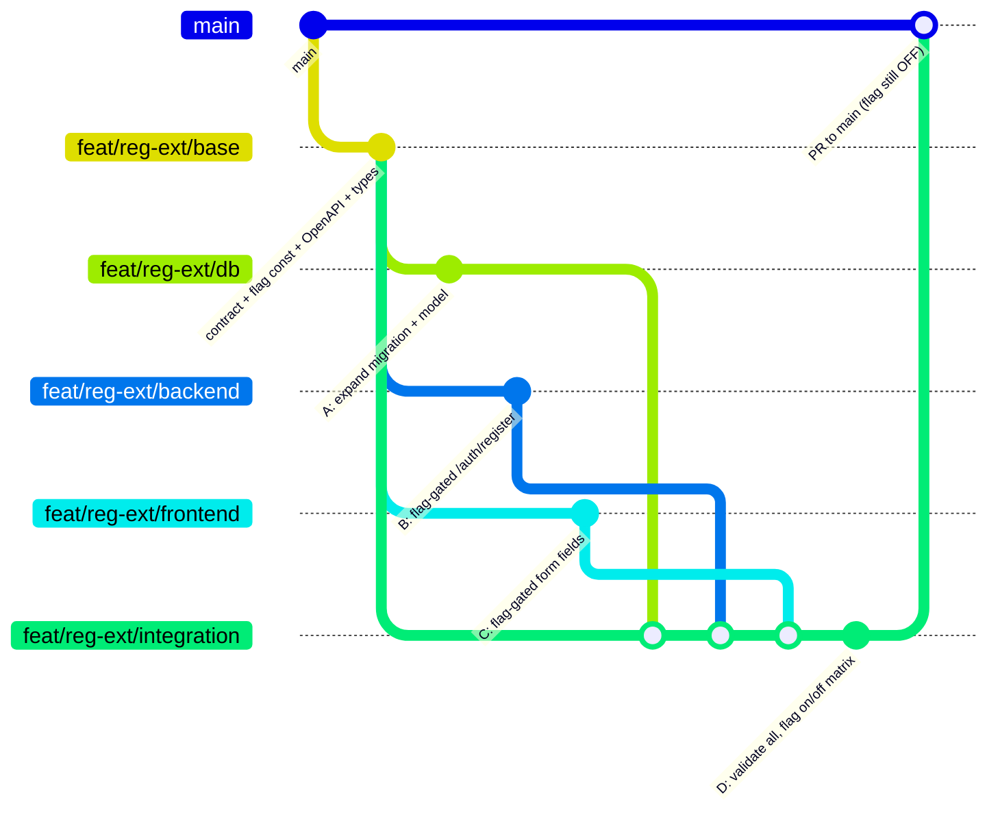

# OPM Registration — Extended Fields Behind a Flagsmith Toggle

**Spec ID:** OPM-FLAG-REG-001
**Owner:** Cross-functional (DB · Backend · Frontend) — **product owner required, see §1**
**Repo:** `open-prompt-manager` (FastAPI + React, `opm-dx1.com`)
**Flag key:** `registration_extended_fields`
**Provider:** Flagsmith, project `opm-dx1` (id `44530`) — see `docs/FEATURE_FLAGS.md`
**Default state:** `OFF` in every environment (dark launch, gradual rollout)
**Change class:** Reversible by flag flip (no redeploy; propagation is **not** instant — §3.5)
**Flag removal owner / date:** _TBD — required by `docs/FEATURE_FLAGS.md` §9 before the flag is created_

> **Revision note.** A previous draft of this spec was written against **Unleash**
> (`flexibleRollout`, `sessionId` stickiness, `useFlag`, `UnleashClient`). This repo
> standardised on **Flagsmith** in PR #389. Everything vendor-specific has been rewritten
> against the live `opm-dx1` project, verified through the Flagsmith API on 2026-07-26.
> Facts confirmed against the live project are marked **[verified]**.

---

## 1. Objective & scope

### 1.1 Problem statement — **OPEN, blocks Stage 0**

_This section is unfilled and must be completed by the product owner before any branch is cut._

The previous draft opened with "add new fields to the registration page" — a solution, not a
need. Required before build:

- **Who** needs this data and **what decision** does it inform?
- **What changes** once we have it (a report, a routing rule, a sales motion, an onboarding path)?
- **What is the cost of not having it** today?

Without this, §9's rollout has no criterion for success other than "nothing broke", and §10's
cleanup has no criterion for keeping the feature at all.

### 1.2 Success measure — **OPEN, blocks Stage 5**

Adding four fields to a signup form is a recognised conversion risk. The rollout **must** be
gated on a funnel metric, not only on error rate and latency:

| Metric | Baseline | Abort threshold |
|---|---|---|
| Registration completion rate (form view → `201`) | _measure for ≥1 week before Stage 5_ | _e.g. relative drop >5% vs flag-OFF cohort_ |
| Extended-field fill rate (of exposed users who register) | n/a | below this, the feature is not delivering data |

The flag split gives a clean A/B comparison for free: compare the ON and OFF cohorts on the
same day rather than against a historical baseline. Instrument this in §8 row 9 before ramping.

### 1.3 Scope

**In scope:** the registration flow (`frontend/src/pages/RegisterPage.jsx`,
`POST /auth/register`) and the `users` table only.
**Out of scope:** login, profile edit, existing-user backfill (a later, separate change).

### 1.4 The new fields — **OPEN, blocks Stage 0**

The table below is the previous draft's *worked example*, retained only to show the shape. It is
**not an agreed field list**. For each field the product owner must specify: required or optional
at submit, exact validation rule, consumer, and retention.

| Field | Type | Nullable (expand phase) | Required at submit? | Notes |
|---|---|---|---|---|
| `company_name` | string(200) | yes | _TBD_ | Free text |
| `job_role` | string(120) | yes | _TBD_ | Free text; enum candidate for §10 |
| `phone` | string(32) | yes | _TBD_ | **PII** — see §2.7 |
| `marketing_opt_in` | boolean | yes (default `false`) | no (must default off) | Consent — see §2.8 |

---

## 2. Non-negotiable guardrails

1. **Contract-first.** The API schema, DB columns, and TS/Pydantic types are agreed *before* any
   layer is built, so the three swarm branches develop in parallel against the same contract.
2. **Everything behind the flag.** With the flag `OFF`, the registration page, API, and stored
   behaviour must be identical to `main`. Testable definition: identical request payload,
   identical response body and status, and an identical persisted row versus a `main` baseline —
   asserted by contract test, not by eyeball.
3. **The OFF path must not depend on Flagsmith being reachable.** `POST /auth/register` is a
   public, unauthenticated endpoint. A Flagsmith outage, timeout, or SDK init failure must
   resolve to the legacy path — never a 5xx, never added latency. This extends
   `docs/FEATURE_FLAGS.md` principle 1 to the backend.
4. **Expand/contract for the database.** New columns land nullable with safe defaults first
   (expand). Constraints are only considered *after* full rollout (contract, §10). Never ship a
   breaking schema change behind a flag.
5. **One flag, evaluated on both sides, same identity.** Frontend and backend evaluate the *same*
   flag against the *same* Flagsmith identity, so a visitor shown the new fields is always
   accepted by the API. See §4.2 — this is the most common failure mode, and under Flagsmith it
   works differently than under Unleash.
6. **Graceful when present-but-off.** The backend treats extended fields as *optional when
   present* throughout rollout, so a mid-rollout percentage change can never hard-fail an
   in-flight registration.
7. **No PII in logs.** `phone` is PII: validate, persist, and audit-log the *event* (SIEM-ready),
   never the raw value — and never any field *value* — in application logs.
8. **Consent is evidence, not a boolean.** `marketing_opt_in` must be stored with the consent
   text version, timestamp, and source. A bare boolean is generally not sufficient proof of
   consent. See §4.4.
9. **No change to existing auth policy.** This change does not touch the password rule
   (currently ≥10 chars with complexity, `backend/app/services/auth_service.py:17`) or the
   email rule. Any change there is a separate spec.

---

## 3. The Flagsmith flag

### 3.1 Live project facts **[verified 2026-07-26]**

| Fact | Value | Consequence for this spec |
|---|---|---|
| Project | `opm-dx1`, id `44530` | — |
| Environments | **`Production` (100174)** and **`Development` (100175)** only | **There is no Staging.** §8 rewritten — see §3.6 |
| Feature naming | `only_allow_lower_case_feature_names: true`, no regex | Key must be lowercase → `registration_extended_fields` |
| Existing flags | 1 (`dashboard_welcome_banner`) | Convention is snake_case; follow it |
| Existing segments | **0** | The rollout mechanism in §3.3 has never been used here — budget time to prove it |
| Versioning | `use_v2_feature_versioning: true` (both envs) | Flag changes need the publish flow, §9.2 |
| Hashing | `use_identity_composite_key_for_hashing: true` | Basis of FE/BE consistency, §4.2 |
| Identities | `use_edge_identities: true`, org `persist_trait_data: true` | Every visitor becomes a stored identity — §3.4 |
| Realtime | `enable_realtime_updates: false` | **Rollback is not instant** — §3.5 |
| Client traits | `allow_client_traits: true` | Browser can write traits; do not trust traits for authorization |
| Plan | Free — **50,000 API calls/month**, 1 seat | Hard capacity ceiling — §3.4 |
| Change requests | `minimum_change_request_approvals: null`, 1 seat | No four-eyes on a flag flip is possible today — §9.4 |

### 3.2 Create the flag

| Setting | Value |
|---|---|
| Name / ID | `registration_extended_fields` |
| Type | Flag (boolean, `STANDARD`) |
| Default | **Disabled**, both environments, at creation |
| Description | Purpose + link to this spec + removal owner/date (per `FEATURE_FLAGS.md` §9) |
| Owner | Set an owner, as `dashboard_welcome_banner` does |

Register the key in the existing central registry so it is not stringly-typed:

```js
// frontend/src/featureFlags/config.js
export const FLAGS = Object.freeze({
  DASHBOARD_WELCOME_BANNER: 'dashboard_welcome_banner',
  REGISTRATION_EXTENDED_FIELDS: 'registration_extended_fields',   // new
});
```

> `stale_flags_limit_days` is **30** on this project **[verified]**. A flag still in place after
> 30 days is surfaced as stale. The §5 timeline (ramp + two-week bake + cleanup) must fit inside
> that, or the staleness is accepted and noted on the flag.

### 3.3 How a percentage rollout actually works in Flagsmith

This is the single biggest departure from the previous draft. Flagsmith has **no
`flexibleRollout` strategy with a stickiness field**. A gradual rollout is expressed as:

1. A **segment** with a `PERCENTAGE_SPLIT` condition (e.g. `PERCENTAGE_SPLIT <= 10`).
2. A **segment override** on `registration_extended_fields` that enables the flag *for that
   segment only*, in one environment.
3. The environment default for the flag stays **disabled** for everyone else.
4. Ramping = editing the segment's percentage value; there is no percentage field on the flag.

Bucketing is deterministic per identity because
`use_identity_composite_key_for_hashing: true` **[verified]** — the hash is over the environment
key plus the identity identifier, so the same identifier lands in the same bucket every time, on
every SDK. That is what replaces Unleash's `stickiness: sessionId`.

**Risk to close in Stage 0:** zero segments exist in this project **[verified]**, and segment
availability/limits on the **Free** plan have not been exercised. Agent D must create the segment
and prove a split works in `Development` *before* branches merge — if the plan does not support
it, the whole ramp design changes (fallback: flip 0% → 100% per environment, with a smaller
blast radius achieved by shipping to Development first).

### 3.4 Capacity and identity-retention constraints **[verified — Free plan]**

**50,000 API calls/month across everything.** Two consequences:

- **Backend polling.** A server SDK in *local evaluation* mode polls the environment document on
  a timer, regardless of traffic. At a 60s interval that is ~43,200 calls/month **per instance** —
  one instance nearly exhausts the quota, and OPM runs multiple ECS tasks. Use **≥300s** (~8,600
  calls/instance/month) and state the chosen interval in §11.3. Slower polling directly increases
  rollback propagation time (§3.5) — that trade-off is the decision.
- **Backend remote evaluation is not viable** at scale here: it would be one API call per
  registration *plus* it would create a stored Flagsmith identity per visitor.

**Identity retention (privacy).** With `use_edge_identities: true` and org-level
`persist_trait_data: true` **[verified]**, calling `identify()` creates a **persistent identity
record** in Flagsmith for every registration visitor. Before Stage 5 the product owner must
confirm:

- The `sessionId` is a random, non-correlatable value (not derived from email, IP, or device).
- No traits carrying PII are ever set on the identity (`allow_client_traits: true`, so this is a
  code discipline, not a platform guarantee).
- A retention/cleanup position exists for identities created by anonymous visitors who never
  register, and Flagsmith is listed as a processor if that is material.

This is new: `dashboard_welcome_banner` runs on authenticated pages and did not raise it.

### 3.5 Rollback is fast, but **not instant**

`enable_realtime_updates: false` **[verified]**. Propagation after a flag change is bounded by:

- **Frontend:** the Flagsmith SDK poll interval, plus `cacheFlags: true`
  (`frontend/src/featureFlags/FeatureFlagProvider.jsx:24`) which serves the **last-known** value
  on load — so an already-open tab, and the first paint after reload, can show stale state.
- **Backend:** the server SDK poll interval chosen in §3.4 (≥300s).

Replace the previous draft's "instant rollback" with a stated worst-case, e.g.
*"legacy behaviour is fully restored within N minutes of the flip; in-flight sessions are handled
by guardrail 6."* Confirm N by measurement in §8 row 6, and publish it in the runbook.

### 3.6 There is no Staging environment — **DECISION REQUIRED**

The previous draft gated the merge to `main` on a full matrix run in `staging`. That environment
does not exist **[verified: only Production and Development]**. Options:

| Option | Cost | Recommendation |
|---|---|---|
| **A. Validate in `Development`** (this spec's working assumption) | none | ✅ Proceed on this basis. Adequate because the flag is OFF in Production regardless of what Development does. |
| **B. Create a `Staging` environment** | new env + client key + deploy target + API-call budget against the 50k ceiling | Only if a staging *deployment* of OPM exists to point it at |

This spec is written for **Option A**. §8 runs the matrix in `Development` with the flag forced
to 100% there, while `Production` stays at 0%.

### 3.7 Keys — keep them separated

- **Client-side Environment key** (`VITE_FLAGSMITH_ENVIRONMENT_ID`) → browser only. Publishable
  by design. Already wired: `frontend/.env.example:28`, `docker-compose.yml:32`.
- **Server-side key** (`ser_...`) → FastAPI only. **New to this repo** — no backend flag
  infrastructure exists today. Never in frontend env, never in the repo, never in client bundles.
- The Flagsmith **admin/user API key** (used by the MCP server) is for humans and tooling only —
  never in application config.

---

## 4. Shared contract (source of truth for all three branches)

### 4.1 Flag constant

```js
// frontend/src/featureFlags/config.js  → FLAGS.REGISTRATION_EXTENDED_FIELDS
```
```python
# backend/app/core/flags.py  (new module)
FLAG_REGISTRATION_EXTENDED = 'registration_extended_fields'
```

Both must resolve to the literal `registration_extended_fields`. Add a test asserting the two
constants match, since there is no shared package between `frontend/` and `backend/`.

### 4.2 The identity handshake (read this twice)

```
Browser mints random sessionId
        │
        ├─►  flagsmith.identify(sessionId)   ── Edge API ─► flags for that identity
        │                                                   (segment % split, deterministic)
        │
        └─►  POST /auth/register  { email, password, sessionId?, extended? }
                     │
                     └─►  Backend re-evaluates the SAME flag for the SAME identity
                          (local evaluation, no per-request API call)
```

- The frontend **never** tells the backend "the flag is on". The backend re-evaluates
  independently. The client's decision is a UI concern; the backend's decision is the source of
  truth for persistence.
- Consistency rests on composite-key hashing **[verified enabled]** producing the same bucket for
  the same identifier on both SDKs. This is the design intent — **it must be proven empirically**
  by §8 row 7 before ramping, not assumed. If FE and BE disagree, the symptom is a 422 spike
  (§9.3).
- **`sessionId` is client-supplied on an unauthenticated endpoint.** A visitor can rotate it
  until they land in the ON bucket, so realised exposure during the ramp is a floor, not an exact
  percentage. Accepted risk for a field-addition; recorded here so the ramp percentages are read
  as approximate. Do not use this identity for anything security-bearing.
- `sessionId` is used for flag evaluation **only** and is **not persisted** to the `users` table.

### 4.3 API contract (OpenAPI fragment)

```yaml
RegisterRequest:
  type: object
  required: [email, password]          # sessionId is NOT required — see note
  properties:
    email:    { type: string, format: email }
    password: { type: string }         # policy unchanged; enforced server-side
    sessionId:{ type: string }         # optional; absent ⇒ flag OFF ⇒ legacy path
    extended:                          # only honoured when flag ON for this identity
      type: object
      properties:
        companyName:    { type: string, maxLength: 200 }
        jobRole:        { type: string, maxLength: 120 }
        phone:          { type: string, maxLength: 32 }
        marketingOptIn: { type: boolean, default: false }
```

Two corrections against the previous draft, both of which would have broken production:

- **`sessionId` is optional.** Making it required is a breaking change to a public endpoint and
  contradicts guardrail 2. Existing clients (and the current `AuthRequest`,
  `backend/app/models/schemas.py:12`) send `{email, password}` only. Absent `sessionId` ⇒ no
  identity ⇒ flag resolves false ⇒ legacy path.
- **No `minLength: 12` on password.** The live policy is ≥10 with complexity
  (`backend/app/services/auth_service.py:17`, documented at `backend/app/api/auth.py:58`).
  The draft's 12 would have silently tightened policy and broken existing tests.

### 4.4 DB contract (expand phase — nullable, safe defaults)

```sql
ALTER TABLE users ADD COLUMN company_name          VARCHAR(200);
ALTER TABLE users ADD COLUMN job_role              VARCHAR(120);
ALTER TABLE users ADD COLUMN phone                 VARCHAR(32);
ALTER TABLE users ADD COLUMN marketing_opt_in      BOOLEAN DEFAULT 0;
-- consent evidence (guardrail 8), not just the boolean:
ALTER TABLE users ADD COLUMN marketing_consent_at  DATETIME;
ALTER TABLE users ADD COLUMN marketing_consent_version VARCHAR(32);
```

Mirror these on the ORM model (`backend/app/models/auth.py:14`) — new environments get their
schema from `create_tables()` / `Base.metadata.create_all`
(`backend/app/database/base.py:26`), *not* from the migration, so both paths need covering.

**PII specification (previously "validate format", which is not a requirement):**

| Field | Format | Purpose | Retention |
|---|---|---|---|
| `phone` | _TBD — E.164 recommended; specify whether non-E.164 input is rejected or normalised_ | _TBD — must be a single stated purpose; "might be useful for MFA later" is not one_ | _TBD_ |

Existing account deletion (`EVENT_ADMIN_USER_DELETE`, `backend/app/audit.py:98`) and any
export/DSAR path must be confirmed to cover the new columns before Stage 5.

---

## 5. Staged implementation plan (risk-ordered)

| Stage | What ships | Flag | Reversible by | Independently deployable |
|---|---|---|---|---|
| **0** | §1 decisions closed · contract agreed · flag created disabled · rollout segment proven in Development (§3.3) | OFF | — | n/a |
| **1** | DB expand migration (nullable cols) + ORM model | OFF | **forward-only, inert** | ✅ safe alone |
| **2** | Backend: Flagsmith server SDK + flag-gated validate/persist | OFF | flag flip | ✅ dark |
| **3** | Frontend: flag-gated new fields | OFF | flag flip | ✅ dark |
| **4** | Integration validation branch (all merged) | OFF | flag flip | gate to prod |
| **5** | Progressive rollout in Production via segment % | ON (ramping) | flag flip | runbook §9 |
| **6** | Contract: constraints (if any), remove flag branches, archive flag | n/a | code revert | after bake |

Stages 1–3 can land in **any order** because each is inert while the flag is off. Stage 4 is the
merge/validate gate. Stage 5 is operational. Stage 6 is cleanup, only after §9 completes and bakes.

**Stage 1 is forward-only.** The previous draft claimed both "forward-only" *and* a clean
down-migration. Pick forward-only: the default dev database is SQLite
(`backend/app/database/base.py:6`), which cannot drop columns on older engine versions, and the
real rollback for this change is the flag flip. Nullable columns left behind are inert.

**Stage 2 is larger than it looks.** It introduces server-side feature flagging to OPM for the
first time — `docs/FEATURE_FLAGS.md` states backend flags are explicitly out of scope today.
That means: new dependency, startup init, config, poll strategy (§3.4), failure semantics
(guardrail 3), and an extension to `docs/FEATURE_FLAGS.md` covering backend usage.

---

## 6. Agent swarm — branching model



- **`feat/reg-ext/base`** — created first, from `main`. Contains only the shared contract (§4):
  flag constants, OpenAPI fragment, TS/Pydantic types, migration stub. All worker branches fork
  from here so they compile against one agreed interface and merge cleanly.
- **Three worker branches fork from `base`** and run in parallel (Agents A, B, C).
- **`feat/reg-ext/integration`** (Agent D) merges all three, then validates the full flag-state
  matrix before a single PR to `main`.
- **Contract changes after fork** are the main merge hazard: any change to §4 must land on `base`
  and be rebased into all three workers by Agent D, not patched locally in one branch.
- **Approval:** the PR to `main` needs a human reviewer named here — Agent D validates, it does
  not approve its own merge.

> The PR to `main` merges with the flag still **disabled**. Merging code and enabling the feature
> are separate acts.

---

## 7. Per-agent briefs (prompt-ready)

Each brief is self-contained. Every agent must: (a) keep all changes behind the flag, (b) prove
the OFF path is unchanged, (c) branch from `feat/reg-ext/base`.

### Agent A — Database (`feat/reg-ext/db`)

**Goal:** Land the expand migration and model plumbing. No constraints yet.
**Do:**
- **Follow this repo's migration pattern — there is no Alembic.** Migrations are idempotent
  Python modules in `backend/migrations/`, run as one-off ECS tasks by `deploy.sh --migrate`
  (`deploy.sh:713-721`). Model it on `backend/migrations/add_user_role.py`: `inspect(engine)`,
  skip if the column exists, `ALTER TABLE ... ADD COLUMN` inside `engine.begin()`.
- Name it `backend/migrations/add_user_extended_fields.py` and **register it in `deploy.sh`**
  alongside `migrations.add_agent_updated_at` and `migrations.add_user_role` — a migration not
  listed there never runs in AWS.
- Add the columns (§4.4) to the ORM model `backend/app/models/auth.py:14` so
  `create_tables()` covers fresh environments.
- Repository/service can read/write the columns, but writes stay caller-gated — the backend
  decides when to write.
**Tests** (mirror `backend/tests/test_migration_user_role.py`):
- Migration is idempotent: running twice is a no-op, and it is safe against a DB where the
  columns already exist via `create_tables()`.
- Existing rows unaffected; `INSERT` without the new fields still succeeds.
- Fresh-DB path (`create_tables()`) and migrated-DB path produce the same schema.
- No `NOT NULL` / enum / check constraints in this branch.
**Done when:** the migration applies to a prod-shaped DB with zero downtime, is registered in
`deploy.sh`, and the OFF path reads/writes exactly as before.

### Agent B — Backend / API (`feat/reg-ext/backend`)

**Goal:** Flag-gate extended-field handling on `POST /auth/register`.
**Do:**
- Add the Flagsmith Python SDK to `backend/requirements.txt` and initialise it **once** at
  startup with the server-side key (§11.2). This is new infrastructure — mirror the isolation
  style of `frontend/src/featureFlags/config.js`: vendor detail in one module
  (`backend/app/core/flags.py`), the rest of the app imports a helper.
- **Local evaluation**, poll interval ≥300s (§3.4). Do not make a Flagsmith API call per request.
- Evaluate for identity `session_id`, with a hard `False` default on: no `sessionId`, SDK not
  initialised, timeout, or any exception. Never let a flag lookup raise into the request path
  (guardrail 3).
- **Flag ON:** validate the `extended` block, persist via Agent A's model, record consent
  evidence (§4.4), emit an audit event.
- **Flag OFF:** ignore any `extended` block entirely; behave exactly as the current endpoint.
- Treat extended fields as *optional when present* to survive a mid-rollout flip (guardrail 6).
- **Audit:** follow the existing scheme in `backend/app/audit.py` — add an `EVENT_*` constant
  (e.g. `EVENT_REGISTER_EXTENDED = 'auth.register.extended'`) or extend the existing
  `EVENT_REGISTER` call at `backend/app/api/auth.py:79` with non-PII attributes. Log **which
  fields were supplied**, never any field value.
**Tests (both flag states):**
- OFF: request with and without `extended` → legacy response, nothing persisted.
- OFF: request with no `sessionId` at all → legacy 201 (regression guard for §4.3).
- ON: valid `extended` persists; invalid `extended` returns 422 with no partial write; missing
  `extended` still registers.
- **Flagsmith unreachable / SDK init failed → legacy 201, no 5xx, no added latency.**
- Same `sessionId` yields the same decision across repeated calls (determinism).
- Audit assertions: event emitted, and no field value appears in any log record.
**Done when:** contract tests pass against §4.3 in both states, the outage path is proven, and
audit logging omits PII.

### Agent C — Frontend (`feat/reg-ext/frontend`)

**Goal:** Render the new fields only when the flag is on for the visitor.
**Do:**
- Mint a random, non-correlatable `sessionId` per visit; call `flagsmith.identify(sessionId)`
  and send the same value in the register request body (§4.2). Set **no traits** (§3.4).
- Read the flag through the existing `useFeatureFlag(FLAGS.REGISTRATION_EXTENDED_FIELDS, false)`
  hook (`frontend/src/featureFlags/FeatureFlagProvider.jsx:39`) — do not import the Flagsmith SDK
  into the page.
- Extend `frontend/src/pages/RegisterPage.jsx` and its validation
  (`frontend/src/utils/authValidation.js`) to mirror the API contract; `marketingOptIn` renders
  **unchecked**.
- Consent copy is rendered from a versioned string so the version can be persisted (§4.4).
- **Flag OFF:** the form is identical to today — no new DOM, no layout shift.
- **Accessibility (ON state):** every input has an associated `<label>`, errors are associated
  via `aria-describedby` and announced, tab order is logical, and the form is completable by
  keyboard alone.
**Tests (both flag states):**
- OFF: existing `AuthForms.test.jsx` assertions still pass unchanged; no extended inputs mount.
  Note flags are forced off in tests by `frontend/.env.test` (`VITE_FLAGSMITH_ENABLED=false`), so
  the OFF state needs no mocking; mock `useFeatureFlag` for the ON state, per
  `docs/FEATURE_FLAGS.md` §9.
- ON: fields render, validate, and submit with `sessionId`.
- ON: accessibility assertions above.
- E2E for both states in the existing Playwright suite — extend
  `e2e-test/specs/auth/auth-ui.spec.ts` (UI) and `auth-api.spec.ts` (contract), which already
  cover registration; CI workflow `.github/workflows/ci.yml`. Note the suite runs against a
  deployed `E2E_BASE_URL`, so the ON state needs the flag enabled in that target environment —
  agree with Agent D how the E2E run gets a deterministic flag state (a dedicated 100% segment
  keyed on a fixed test `sessionId` is the cleanest option).
**Done when:** the flag toggles the UI, the OFF state has no visual or test regression, and the
ON state passes the a11y checks.

### Agent D — Integration & validation (`feat/reg-ext/integration`)

**Goal:** Merge A + B + C and prove the whole thing before it can reach prod. **Ships nothing
new.** Also owns the Stage 0 de-risking in §3.3 (create the rollout segment, prove a split works
in Development). See §8.

---

## 8. Validation branch — acceptance matrix

Agent D merges the three branches and runs the full matrix in **`Development`** (there is no
Staging — §3.6) with the flag at 100% there, while `Production` stays disabled.

| # | Scenario | Expected |
|---|---|---|
| 1 | Flag **OFF**, register without extended | Legacy behaviour, new columns stay null |
| 2 | Flag **OFF**, register *with* stray extended block | Ignored, no error, nothing persisted |
| 3 | Flag **ON**, full journey | Fields render → validate → persist → visible in DB |
| 4 | Flag **ON**, invalid extended payload | 422, no partial write |
| 5 | **Cross-stack consistency** | Same `sessionId`: UI shows fields ⇔ API accepts them |
| 6 | **Rollback** — disable the flag mid-session | Returns to legacy cleanly, no 5xx. **Measure and record actual propagation time** (§3.5) |
| 7 | **Bucketing determinism across SDKs** | A fixed set of `sessionId`s produces the *same* ON/OFF split in the browser SDK and the Python SDK (proves composite-key hashing agrees — §4.2) |
| 8 | **Non-functional** (k6 smoke + load) | No latency/error regression vs baseline on `/auth/register`; confirm local evaluation adds no per-request network call |
| 9 | **Observability** | Flag-exposure and error rate split by flag state, **plus the §1.2 funnel metric**, visible before the ramp starts |
| 10 | **Audit** | Audit event present for extended writes; no PII and no field values in app logs |
| 11 | **Flagsmith unavailable** | SDK init failure / network blackhole → legacy 201, no 5xx, no latency spike (guardrail 3) |
| 12 | **Legacy client** | `POST /auth/register` with `{email, password}` only → 201, unchanged (guardrail 2) |
| 13 | **Flip during submit** | Flag disabled between form render and POST → request with `extended` is accepted or gracefully ignored, never 422 (guardrail 6) |
| 14 | **Identity rotation / abuse** | Repeated attempts with rotating `sessionId` do not bypass rate limiting or lockout |
| 15 | **Segment mechanics** | The `PERCENTAGE_SPLIT` segment + override actually works on the current plan (§3.3) and the percentage can be changed without a deploy |

**Gate:** all fifteen green → PR to `main` for human review (flag remains disabled). Any red →
back to the owning worker branch.

---

## 9. Progressive rollout runbook (Stage 5)

Run only after §8 is green, the §1.2 baseline has been measured, and the PR is merged to `main`
with the flag disabled.

### 9.1 Ramp

`0% → 1% → 10% → 25% → 50% → 100%`, by editing the `PERCENTAGE_SPLIT` value on the rollout
segment (§3.3). Hold each step for a **stated bake window** — define it here, e.g. 24h for 1%
and 10%, 48h for 25% and 50%. "One bake window" is not a specification.

### 9.2 How to change the percentage (v2 versioning) **[verified enabled on both envs]**

Both environments use `use_v2_feature_versioning`, so a change is not a single write:

1. Create a new environment feature version.
2. Set the feature/segment-override state on that version.
3. **Publish** the version — it is not live until published.

Via MCP: `create_environment_feature_version` → `create_environment_feature_version_state` →
`publish_environment_feature_version`. Via the dashboard, the UI does this for you. Either way,
**verify the version is live** afterwards — an unpublished version is the most likely cause of
"I changed it and nothing happened".

### 9.3 Per-step guardrails

- Registration completion rate within the §1.2 abort threshold **(the metric that can kill this
  feature — check it first)**
- `/auth/register` error rate ≤ baseline + 0.5pp
- p95 latency within +10% of baseline
- No spike in 422 rate (indicates FE/BE contract drift, i.e. bucketing disagreement — §4.2)
- Flagsmith API call volume tracking against the 50,000/month ceiling (§3.4)

Instrument against this repo's actual telemetry — **OpenTelemetry**
(`frontend/src/telemetry/otel.js`, dashboards in `operations/opm-dashboard.json`), not Datadog as
the previous draft assumed. If OTLP is exported to a Datadog backend, state that explicitly here.

### 9.4 Roles and authority

- **Who flips:** named RTE / owner.
- **Who can call rollback:** anyone on call, without escalation.
- **Out of hours:** do not advance a step outside working hours; rollback is always allowed.
- **Four-eyes:** not currently possible — the org has **1 seat** and
  `minimum_change_request_approvals: null` **[verified]**. Accept this, or provision a second
  seat and enable change requests before Stage 5. Record the decision.

### 9.5 Rollback

Disable the flag (or set the segment to 0%) in Flagsmith. No redeploy. Restoration is bounded by
the propagation time measured in §8 row 6 — **not instant** (§3.5). Because the DB columns are
nullable, no data cleanup is required; rows written while ON keep their values harmlessly.

---

## 10. Cleanup — the contract phase (Stage 6)

Only after 100% has baked for an agreed window (e.g. two weeks — mind the 30-day staleness
threshold, §3.2) and the change is confirmed permanent:

1. Confirm against §1.2 that the feature is worth keeping. If the funnel metric regressed and the
   data is not being used, the correct outcome is **removal**, not promotion.
2. Backfill defaults for rows created while off, if applicable.
3. Add deferred constraints **only where genuinely wanted**. Note the previous draft's blanket
   `NOT NULL` is wrong here: the fields are optional by design, and SQLite cannot add `NOT NULL`
   to an existing column without a table rebuild. Realistically this is limited to
   `marketing_opt_in`.
4. Remove the flag branches from FE and BE; the code path becomes unconditional.
5. Remove the backend Flagsmith SDK **only if** no other backend flag has adopted it by then.
6. Archive the flag in Flagsmith and remove the key from `FLAGS`.
7. Remove now-dead OFF-path tests; keep the behavioural tests.

---

## 11. Appendix — reference snippets

### 11.1 Frontend (React, Vite)

The provider and hook already exist — do not add a second Flagsmith integration.

```jsx
import { useFeatureFlag } from '../featureFlags/FeatureFlagProvider';
import { FLAGS } from '../featureFlags/config';

const showExtended = useFeatureFlag(FLAGS.REGISTRATION_EXTENDED_FIELDS, false);
// OFF (or SDK disabled / not loaded) ⇒ false ⇒ nothing mounts
```

Identity for the percentage split (§4.2) — the `sessionId` must reach both Flagsmith and the API:

```js
// mint once per visit; random, not derived from anything about the user
const sessionId = crypto.randomUUID();
await flagsmith.identify(sessionId);   // no traits — see §3.4
// ...and include sessionId in the POST /auth/register body
```

> `FeatureFlagProvider` currently starts the SDK anonymously. Wiring `identify()` into the
> provider (rather than the page) is Agent C's design call — it must not regress the existing
> `dashboard_welcome_banner` evaluation.

### 11.2 Backend (FastAPI, Python) — new infrastructure

```python
# backend/app/core/flags.py — vendor detail isolated here, mirroring the frontend config module
from flagsmith import Flagsmith

FLAG_REGISTRATION_EXTENDED = 'registration_extended_fields'

_client = Flagsmith(
    environment_key=settings.FLAGSMITH_SERVER_KEY,      # ser_... — server-side only
    api_url=settings.FLAGSMITH_API_URL,
    enable_local_evaluation=True,                        # no API call per request (§3.4)
    environment_refresh_interval_seconds=300,            # ≥300s against the 50k/month ceiling
) if settings.FLAGSMITH_SERVER_KEY else None


def extended_enabled(session_id: str | None) -> bool:
    """False on: no session, no client, timeout, or any error (guardrail 3)."""
    if not session_id or _client is None:
        return False
    try:
        flags = _client.get_identity_flags(identifier=session_id)
        return flags.is_feature_enabled(FLAG_REGISTRATION_EXTENDED)
    except Exception:
        logger.warning('flag lookup failed; using legacy path')   # no session_id in the log
        return False
```

```python
@router.post('/register')
def register(payload: AuthRequest, request: Request, db=Depends(get_db)):
    # ...existing email/password validation and duplicate check, unchanged...
    user = create_user(db, normalized_email, payload.password, role=role)

    if extended_enabled(payload.session_id) and payload.extended:
        apply_extended(db, user, payload.extended)        # validates → 422 on failure
        audit_event(EVENT_REGISTER_EXTENDED, request=request, actor=normalized_email,
                    target=user.id, outcome='success', fields=supplied_field_names)  # names only
    # OFF path: identical to today; any extended block is ignored
    return RegisterResponse(id=user.id)
```

> Ordering note for Agent B: validating `extended` **after** `create_user` risks a partial write
> on a 422 (matrix row 4). Validate the extended block before persisting anything, or wrap both
> in one transaction. Agent B owns this decision and must cover it with a test.

The exact SDK signatures must be confirmed against current Flagsmith Python SDK docs at
implementation time — this is illustrative, and no backend SDK is installed in the repo today.

### 11.3 Environment variables

```
# Frontend — already wired (frontend/.env.example, docker-compose.yml)
VITE_FLAGSMITH_ENVIRONMENT_ID=<client-side Environment key>
VITE_FLAGSMITH_API_URL=https://edge.api.flagsmith.com/api/v1/
VITE_FLAGSMITH_ENABLED=true

# Backend — NEW, must be added to .env.example, docker-compose.yml and the ECS task definition
FLAGSMITH_SERVER_KEY=<ser_... server-side key>          # secret — never in the frontend
FLAGSMITH_API_URL=https://edge.api.flagsmith.com/api/v1/
FLAGSMITH_REFRESH_INTERVAL_SECONDS=300
```

Backend flags must also be documented in `docs/FEATURE_FLAGS.md`, which currently scopes itself
to the frontend only.

### 11.4 References

- `docs/FEATURE_FLAGS.md` — repo conventions, test setup, flag hygiene (§9: removal owner/date)
- Flagsmith: segments and `PERCENTAGE_SPLIT` operator; identities and traits; Edge API
- Flagsmith Python SDK: local evaluation, `get_identity_flags`, default handlers
- Flagsmith v2 feature versioning: create version → set state → publish

---

## 12. Open decisions blocking Stage 0

| # | Decision | Owner | Blocks |
|---|---|---|---|
| 1 | Problem statement and consumer of the data (§1.1) | Product | Everything |
| 2 | Final field list, required-vs-optional per field (§1.4) | Product | Contract, all branches |
| 3 | `phone` format, purpose, retention (§4.4) | Product + Security | Agent A, Agent B |
| 4 | Consent copy + version scheme (§4.4) | Product + Legal | Agent A, Agent C |
| 5 | Funnel baseline and abort threshold (§1.2) | Product + RTE | Stage 5 |
| 6 | Validate in Development vs create Staging (§3.6) | RTE | §8 |
| 7 | Identity retention position for anonymous visitors (§3.4) | Security | Stage 5 |
| 8 | Backend poll interval vs rollback speed trade-off (§3.4, §3.5) | Backend + RTE | Stage 2 |
| 9 | Four-eyes on flag flips: accept single-seat, or provision (§9.4) | RTE | Stage 5 |
| 10 | Flag removal owner and date (header, `FEATURE_FLAGS.md` §9) | RTE | Flag creation |

---

*Definition of Done for the whole change:* §12 decisions closed · flag created disabled in both
environments · rollout segment proven · DB expanded (nullable) · FE & BE gated and dark ·
validation matrix (§8) green · rolled to 100% with clean guardrails **including the funnel
metric** · flag archived and code paths unconditional (§10).
