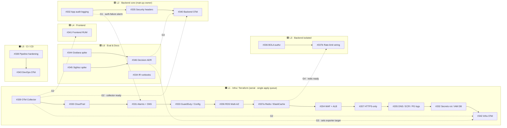

# Parallel Delivery Plan — Agent Swarm Dependency Map

_Generated 2026-07-03 from the 22 open issues across Milestones #1 (SAST Exceptions), #2 (Detection & Response), #3 (Observability & OpenTelemetry) plus the standalone app-security issues._

**Goal:** deliver as many issues as possible simultaneously with multiple agents, guaranteeing they never collide.

**Governing principle:** parallelism is bounded by **shared files and shared Terraform state**, not by logical dependencies. Two agents may run concurrently **iff their file-write sets are disjoint**. Everything below is derived from that rule.

---

## 1. Shared-file conflict hotspots (why we can't just run all 22 at once)

| Shared surface | Issues that write it | Consequence |
|---|---|---|
| `.sast-exceptions.json` | #202, #204, #205, #206, #207 | 5-way conflict → must serialize |
| `terraform/` state (remote) | every infra issue | concurrent `apply` races → **one apply queue** |
| `terraform/iam.tf` | #202, #204, #330, #333 | serialize (or self-contain IAM per file) |
| `terraform/ecs.tf` | #207, #339, #342 | serialize |
| `terraform/rds.tf` | #202, #205, #206, #342 | serialize |
| `terraform/variables.tf` | #202, #204, #206, #339 | serialize |
| `terraform/alb.tf` | #204, #207 | serialize |
| `terraform/s3.tf` | #330, #333 | serialize |
| `terraform/otel.tf` (new) | #339, #342 | serialize |
| `backend/main.py` | #332, #335, #340 | serialize |
| `.github/workflows/deploy.yml` | #338, #343 | serialize |

**Isolated (no conflicts, safe to run anytime):** #336 (`prompts.py`), #337-app (`rate_limit.py`), #341 (`frontend/`), #334 (`docs/runbooks/`), #344/#345 (throwaway sandboxes — zero repo files).

---

## 2. Lane assignment (file ownership = collision-free)

Each lane has **exactly one owning agent** and an exclusive set of files. No file appears in two active lanes.

| Lane | Owner scope (exclusive files) | Issues (in serial order) |
|---|---|---|
| **L1 · Infra/Terraform** | all `terraform/`, `.sast-exceptions.json`, remote state, `helm/` | #339 → #330 → #331 → #333 → #206 → #337a(Redis) → #204 → #207 → #205 → #202 → #342 |
| **L2 · Backend core** | `backend/main.py`, `app/services/`, `app/logging/`(new), `app/api/` auth/admin | #332 → #335 → #340 |
| **L3 · Backend isolated** | `app/api/prompts.py`, `app/middleware/rate_limit.py` | #336 → #337b(app wiring) |
| **L4 · Frontend** | `frontend/` | #341 |
| **L5 · CI/CD** | `.github/workflows/` | #338 → #343 |
| **L6 · Eval & Docs** | sandbox envs, `docs/` | (#344 ∥ #345) → #346 ; #334 anytime |

> #337 is split: **#337a** provisions Redis/ElastiCache (Terraform → L1); **#337b** wires the limiter to it (`rate_limit.py` → L3). They meet at gate **G4**.

---

## 3. Dependency graph

---

## 4. Cross-lane gates (the only synchronization points)

| Gate | Upstream (must merge first) | Unblocks | Note |
|---|---|---|---|
| **G1** | #332 (L2) | auth-failure metric-filter alarm in #331 (L1) | L1 ships base ALB/ECS/RDS alarms first, adds this after |
| **G2** | #339 (L1) | E2E validation of #340, #341, #342 | Instrumentation *code* can be written earlier; only end-to-end test waits |
| **G3** | #344 + #345 → #346 (L6) | final exporter target in #339/#342, SDK backend config in #340/#341 | OTel is backend-agnostic, so only final config waits |
| **G4** | #337a Redis (L1) | #337b limiter wiring (L3) | |

---

## 5. Wave schedule

**Wave 1 — up to 8 agents start immediately, zero file overlap:**
`#339` (L1) · `#332` (L2) · `#336` (L3) · `#341` (L4) · `#338` (L5) · `#344` + `#345` (L6) · `#334` (L6)

**Wave 2 — after each lane's Wave-1 item merges:**
L1 `#330 → #331(base)` · L2 `#335` · L5 `#343` · L6 `#346` (after spikes)

**Wave 3+ — L1 drains its queue** (`#333 → #206 → #337a → #204 → #207 → #205 → #202 → #342`), with L2 `#340`, L3 `#337b`, and G1/G3 revisits folded in.

**Critical path = Lane 1** (~11 serial Terraform issues). Every other lane finishes far earlier. See the optimization below to shorten it.

---

## 6. Optimization — unlock Terraform parallelism (optional, high impact)

Lane 1 is the bottleneck only because issues touch shared `iam.tf` / `s3.tf` / `variables.tf`. If each new feature is implemented **self-contained** — its own `*.tf` file carrying its own IAM role/policy and variables instead of appending to shared files — then the new-file-dominant issues become file-disjoint and can split into **up to 3 infra sub-lanes**:

- **L1a (new-file features):** #330 `cloudtrail.tf`, #333 `guardduty.tf`/`config.tf`, #339 `otel.tf`, #331 `monitoring.tf`
- **L1b (existing-file edits):** #206, #204, #207, #205, #202 (the `.sast-exceptions.json` + `rds.tf`/`alb.tf` cluster — keep serial)
- **L1c:** #337a Redis, #342 Infra OTel

**Non-negotiable even when split:** `terraform apply` still serializes through a **single merge queue** (one shared remote state). Parallelize the *authoring/PRs*, serialize the *apply*.

---

## 7. Rules of engagement (for every agent)

1. **One branch per issue** — `issue-<n>-<slug>`; open a draft PR immediately.
2. **File ownership is exclusive** — never edit a file owned by another active lane. If you must, it's a gate: hand off, don't co-edit.
3. **Terraform apply is single-threaded** — all infra PRs merge through one queue; never two concurrent `apply`s.
4. **Rebase on `main` before opening for review**; keep PRs small and lane-scoped.
5. **Respect gates** — don't start gated work until the upstream issue is merged to `main`.
6. **OTel is backend-agnostic** — build #340/#341/#342 against the Collector; only final exporter config waits on #346.
7. **Redact secrets/PII** in any logging/telemetry work (#332, #340, #341).
